# RTL2GDS Workshop  
## Week 1 – Day 2 Notes

---

## Width and Height of Core and Die

Assume a circuit with a launch flip-flop, a capture flip-flop, and combinational logic in between them. :contentReference[oaicite:0]{index=0}  

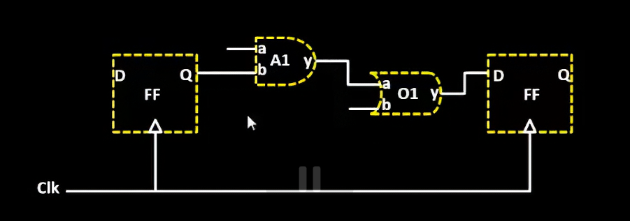

While determining the width and height of the core, the **dimensions of the cells** matter more than the wiring and routing at this stage.

Assume:
- All cells (flip-flops and standard cells) have dimensions of **1 × 1 unit**

This circuit can be placed in a **2 × 2 grid**, where the total size of the netlist is **2 × 2 units**.

Since the area of the netlist equals the area of the die:
- **Utilization Factor = 1**

**Formulas:**
- Utilization = Area of Netlist / Area of Die  
- Aspect Ratio = Height / Width  

If the aspect ratio = 1, the die is a square.

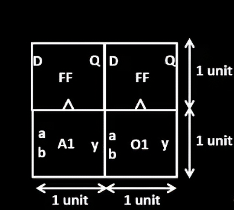

---

## Preplaced Cells

Tools optimize numerical metrics such as:
- Area  
- Wirelength  

However, humans understand the **intent of the design**.

For example:
- A placement tool may place a cache in a corner to increase utilization.
- A designer knows the CPU must communicate with the cache every cycle.
- Placing it in a corner may interfere with I/O pins and degrade performance.

### Conclusion:
- Placement tools allow **preplaced cells**
- These are manually placed based on design intent
- The tool must work around them during optimization

---

## Decoupling Capacitors

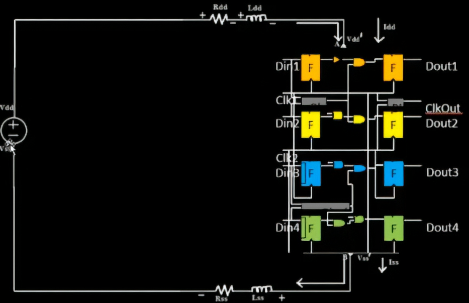

In this circuit:
- The power supply is far from the load
- Long wires introduce resistance and parasitic effects (inductance/capacitance)

This affects signals because:
- 0 → 1 transition requires instant charge  
- 1 → 0 transition requires instant discharge  

### Solution:
- Place a **large capacitor near the circuit**

### Purpose:
- Provide local charge during high switching activity
- Reduce dependency on distant power supply
- Maintain noise margins
- Prevent cascading failures

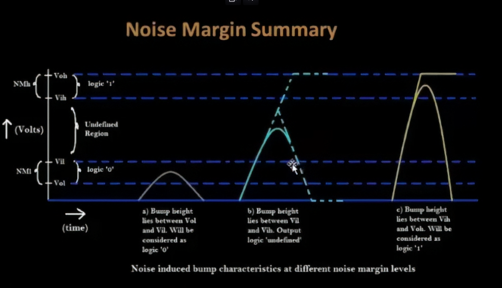

### Drawbacks:
- Risk of resonance  
- Increased static power usage  
- Increased area  
- More complex routing  

---

## Power Planning: Voltage Droop and Ground Bounce

### Ground Bounce

Assume a 16-bit bus driving an inverter circuit:

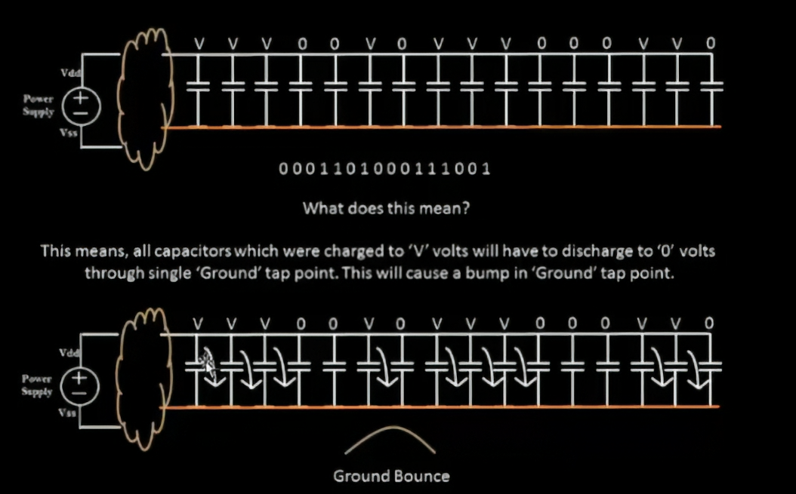

When all signals switch simultaneously:
- Charge is dumped into the ground line
- Ground voltage temporarily rises

This is called **ground bounce**

---

### Voltage Droop

Similarly:

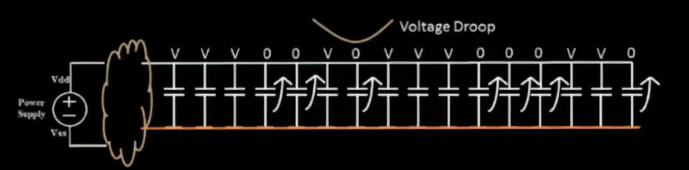

When many signals switch from 0 → VDD:
- Large current is drawn
- Supply voltage temporarily drops

This is called **voltage droop**

---

## Solution: Power Mesh

Instead of a single power source:

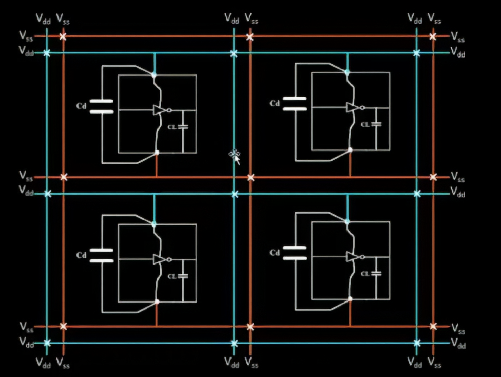

Use:
- **Distributed power grid (mesh)**

### Benefits:
- Reduces distance between supply and load  
- Minimizes IR drop  
- Improves power stability  

---

## Example Circuit with Power Mesh

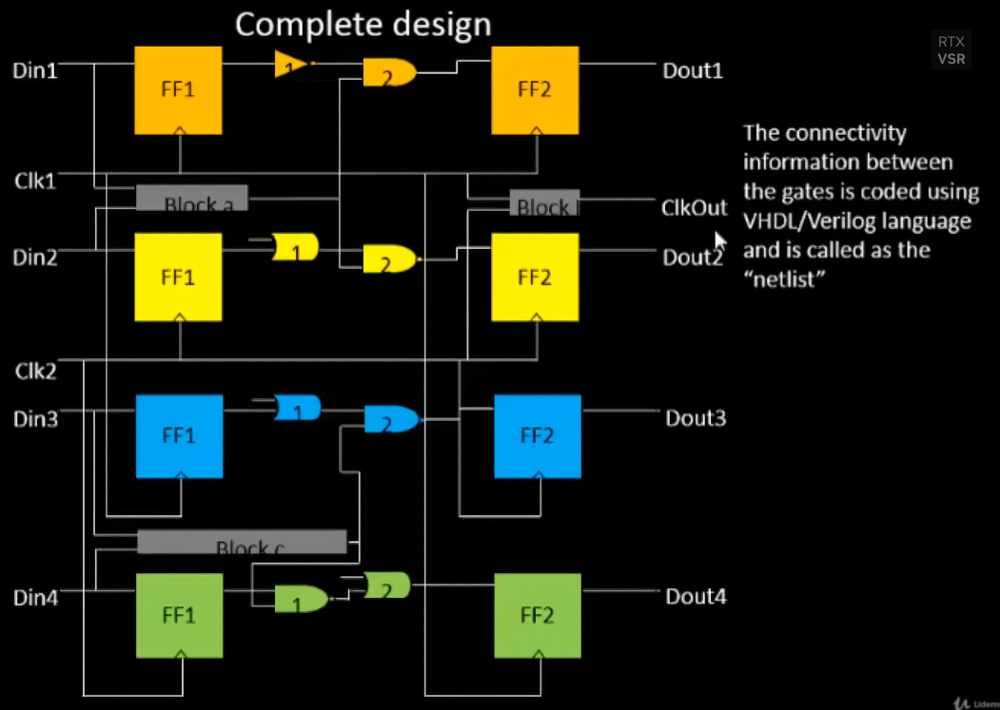

- Inputs on the left  
- Outputs on the right  

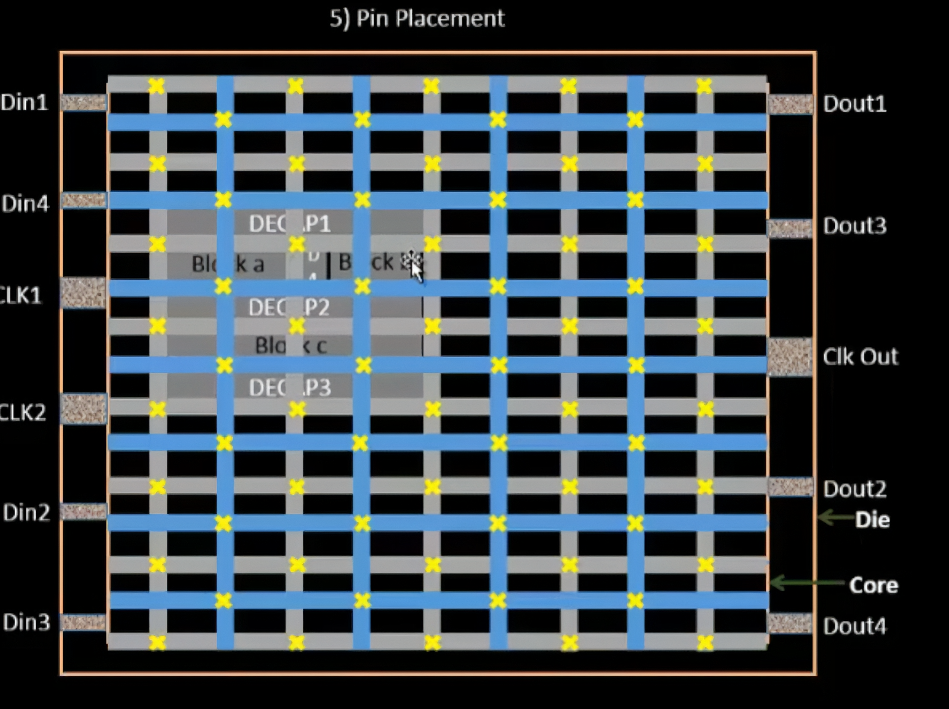

The power mesh ensures robust power delivery across the design.

---

## Tradeoff Example

- Block B could be placed closer to `clk_out`
- But this would require an additional decoupling capacitor

→ This is a **design tradeoff between performance and area/power**

---

## Additional Notes

- Clock ports are larger because they drive many cells  
  → Larger area reduces resistance  

- Placeholder cells are placed at boundaries:
  - Prevent placement near edges  
  - Reserve space for I/O pins  

---

## Floorplan (OpenLane)

Performed on a Linux machine using OpenLane for:
- Faster computation  
- Lower latency  
- Better usability  

### Floorplan Run

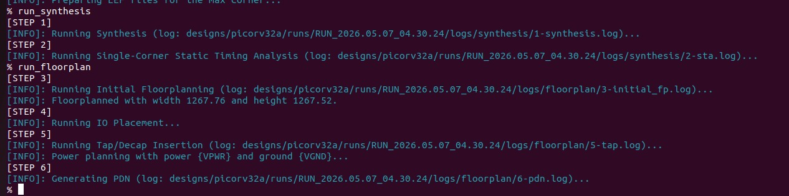

### Default Configuration

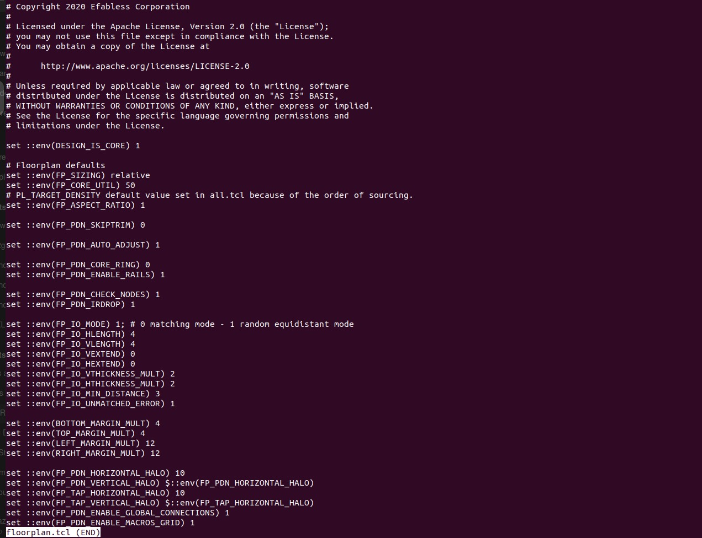

### Configuration Priority

```
System defaults < config.tcl < PDK-specific config.tcl
```

---

## IO Layer Observation

Observed:
- Horizontal layer: **H-3**
- Vertical layer: **V-2**

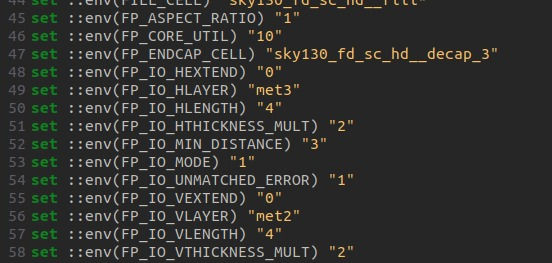

Tutorial values:
- H-4  
- V-5  

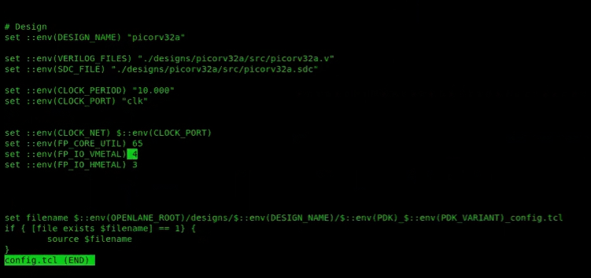

Reason:
- Tutorial defines IO metal layers in config
- Default setup does not

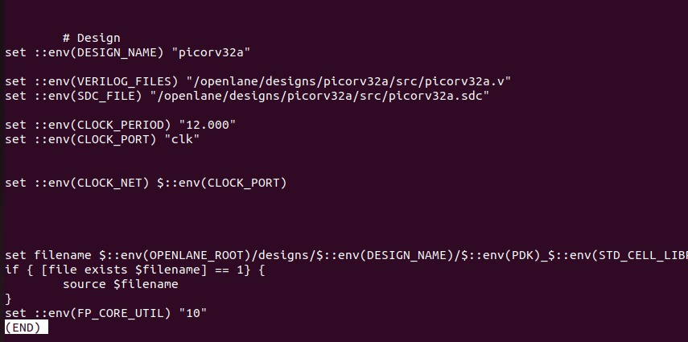

---

## Layer Ordering Insight

- Your setup: Horizontal above vertical  
- Tutorial: Vertical above horizontal  

This is not inherently wrong, but has tradeoffs:

- Higher metal layers → thicker → lower resistance  

### Implications:
- Wide buses / pipelines → prefer horizontal on top  
- Control signals / fanout → prefer vertical on top  

---

## Important Notes

- Placement is NOT done during floorplanning  
- PDK defines metal layer directions  
- Limited flexibility in changing this  

---

## Config Validation

Config file overrides defaults:

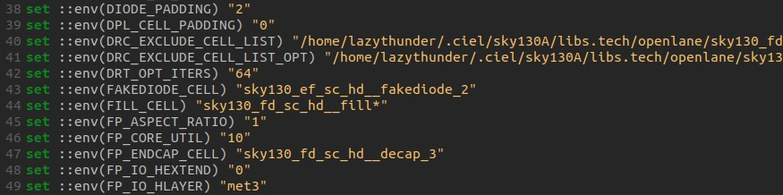

Confirmed by modifying core utilization:

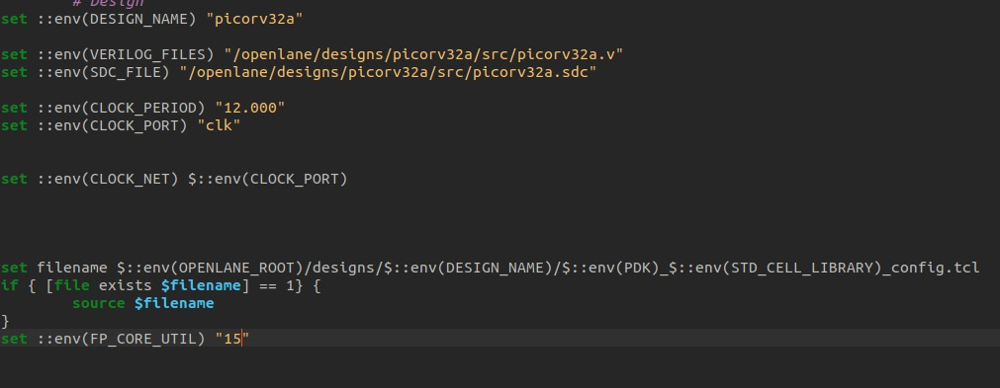  
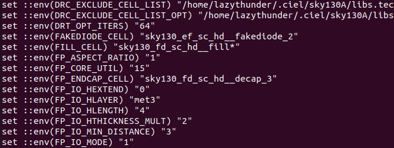

Even though config.tcl still shows:
- `fp_core_util = 50`

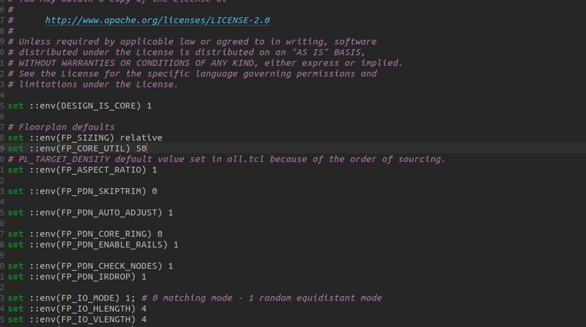

---

## Die Area Calculation

From `picorv32a.def`:

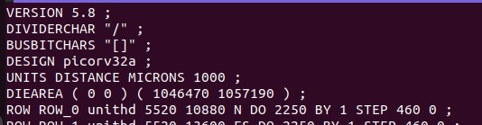

- Units = nanometers (scale = 1000)

Convert to microns:
- Divide by 1000  

Result:
- ~ (1046.47 µm, 1057.19 µm)

Variation due to:
- Core utilization set to 15%

---

## Magic Layout Visualization

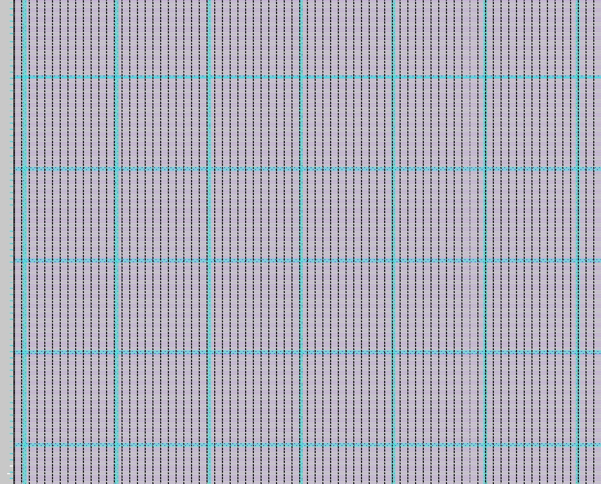

Had to:
- Launch Magic manually with tech file  
- Load LEF and DEF inside GUI  

Reason:
- Errors when running combined commands  

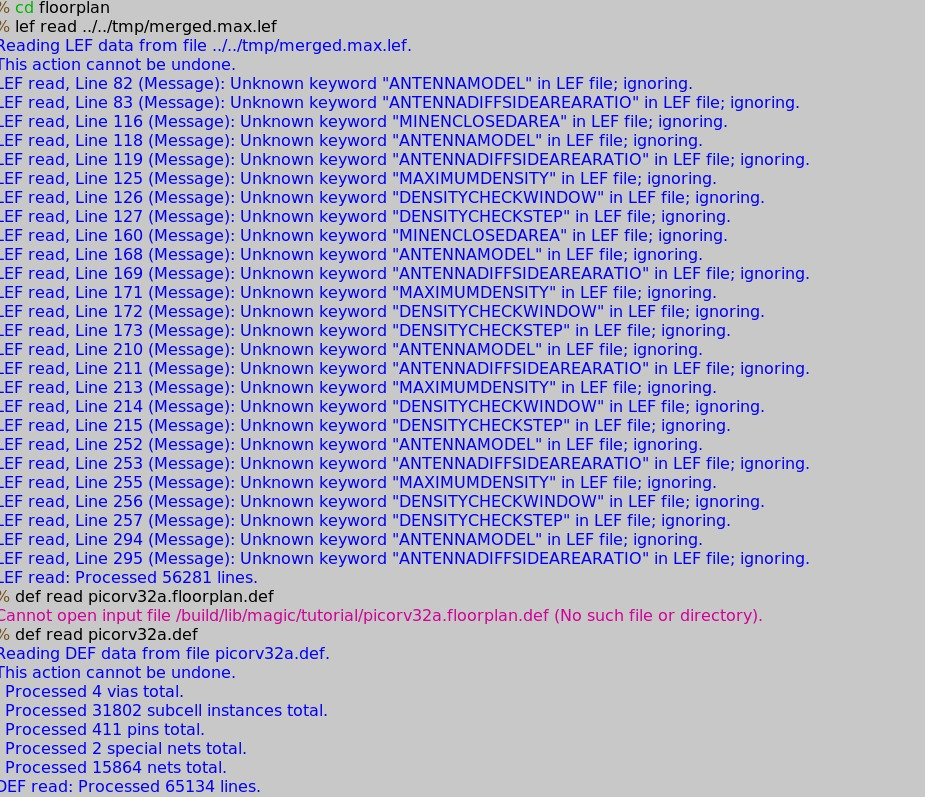  


---

## Observations in Layout

- Power mesh visible:

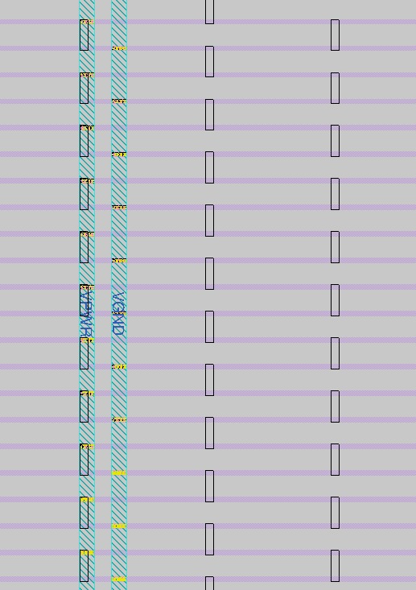

- Standard cells appear placed:

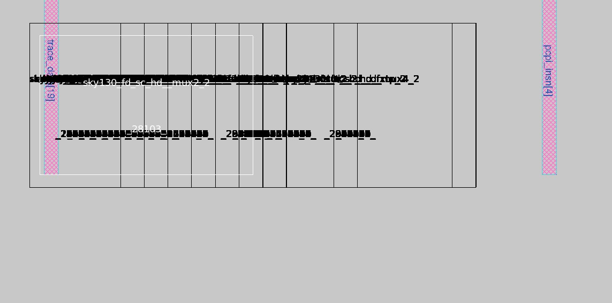

### Why?
- Floorplan = high-level planning  
- Placement = optimization step  

---

## Standard Cell Insight

- Cells have **discrete heights and widths**
- Enables grid-based placement (like LEGO)

---

## Placement

### Goal:
Bind netlist to **physical cells**

### Libraries contain:
- Timing  
- Delay  
- Power  

---

### Cell Variations

Same logic gate can have:
- Different sizes → drive strength  
- Different Vt → speed vs noise  

---

## Wire Effects

**Resistance:**
\[
R = \rho \frac{L}{A}
\]

- Longer wires → higher resistance  

**Capacitance:**
- Also increases with length  
- Due to interaction with:
  - Neighbor wires  
  - Substrate  

Effective area depends on **length exposure**, not just cross-section.

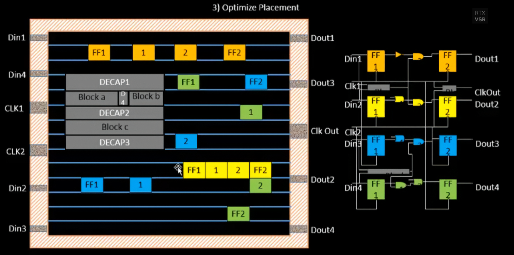

---

## Signal Integrity

- Spread cells evenly → balanced delay  
- Cells can act as repeaters  
- Extra repeaters:
  - Improve signal  
  - Increase area  

---

## Slew

- Measures transition speed of signal  

We want:
- **Low slew → faster transitions**

Used to:
- Determine need for repeaters  

---

## Design Flow Overview

1. Logic Synthesis  
2. Floorplanning  
3. Placement  
4. Clock Tree Synthesis (CTS)  
5. Routing  
6. Static Timing Analysis (STA)  

---

## Placement Details

### Stages:
- Global Placement  
- Detailed Placement  

### Legalization:
- Align cells to rows  
- Remove overlaps  

### Objective:
- Minimize wirelength  

Metric:
- **HPWL (Half Perimeter Wire Length)**  

---

## Placement Run

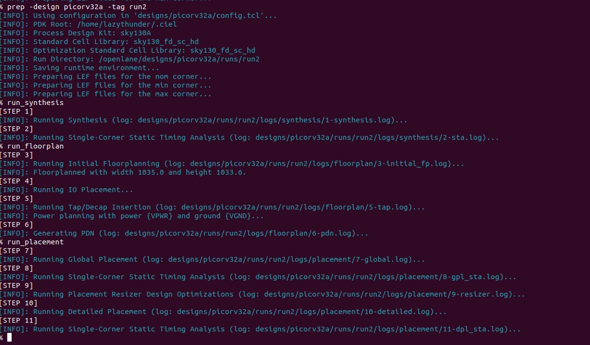

Final layout in Magic:

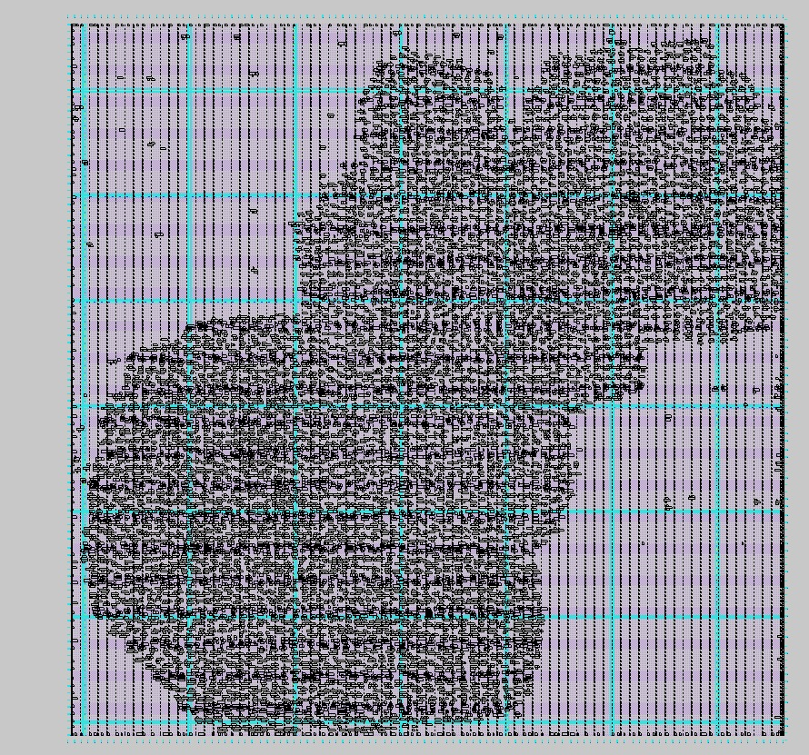

---

## PDN

- Performed after:
  - Floorplan  
  - Placement  
  - CTS  

---

## Cell Design Flow

### 1. Inputs

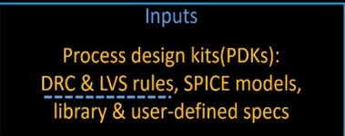

- PDK rules define constraints  

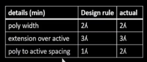

---

### 2. Design Steps

- Implement logic using PMOS and NMOS  
- Choose **Euler path** for layout optimization  

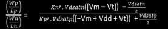

### Purpose:
- Minimize diffusion breaks  
- Reduce capacitance and leakage  

---

### 3. Output

- Extract parameters:
  - Timing  
  - Power  

---

## SPICE Extraction

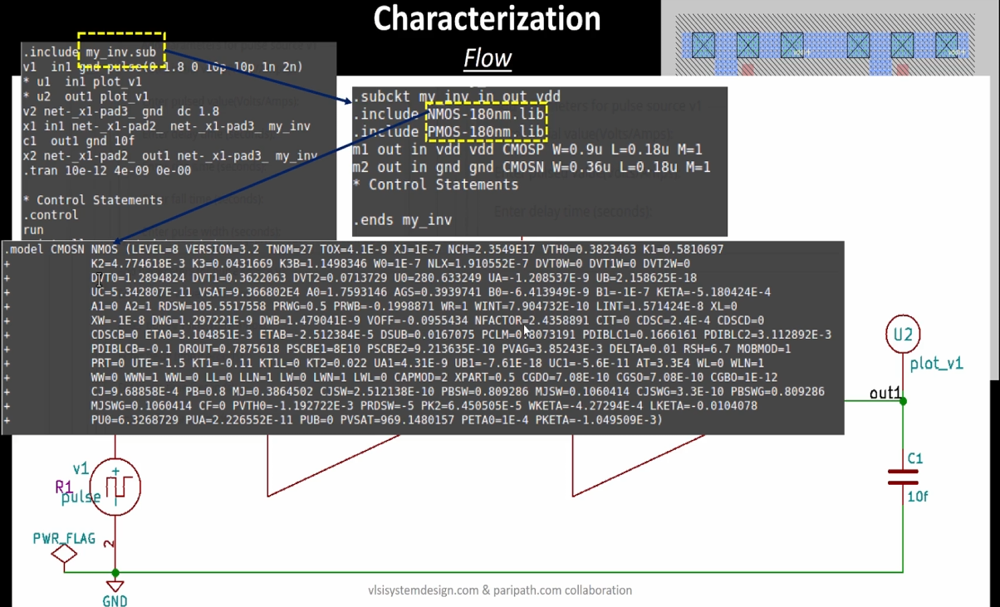

- Extracted netlist represents circuit in analog form  
- Uses subcircuits (e.g., buffers built from inverters)  
- Includes parasitic effects from process  

---

## Characterization

- Vary output capacitance  
- Observe behavior  

Purpose:
- Capture nonlinear effects  

---

## Timing Calculations

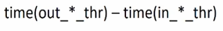

- Negative delay arises from poor threshold selection  

### Industry Standards:
- Delay threshold = **50%**
- Slew thresholds = **20%–80%**

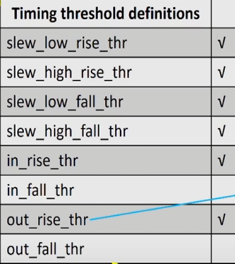

```
slew_low_rise_thr = 20%
slew_high_rise_thr = 80%
slew_low_fall_thr = 20%
slew_high_fall_thr = 80%
in_rise_thr = 50%
in_fall_thr = 50%
out_rise_thr = 50%
out_fall_thr = 50%
```

---