# Week 1 Report – OpenLane (picorv32a)

---

## 1. Setup and Environment Verification

The initial step involved setting up the GitHub Codespace environment and verifying that OpenLane was correctly installed and functional.

This included:
- Launching the Codespace
- Ensuring dependencies were installed
- Verifying OpenLane commands execute without errors

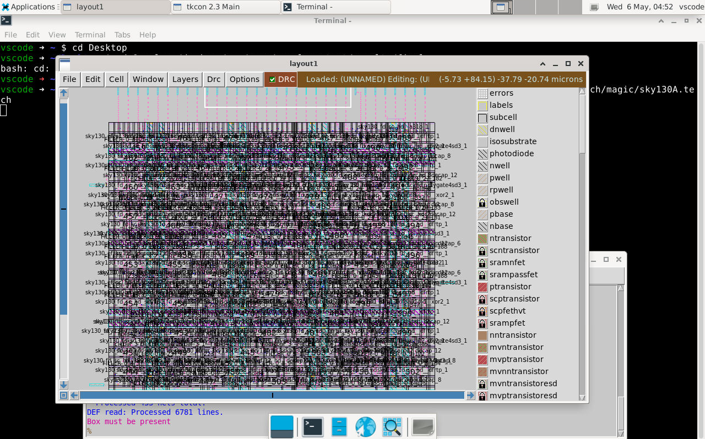

---

## 2. Running a Custom Design (picorv32a)

A custom RISC-V core design (`picorv32a`) was selected and executed through the OpenLane flow.

Steps involved:
- Navigating to the `designs` directory
- Selecting the `picorv32a` design
- Running the OpenLane automated flow

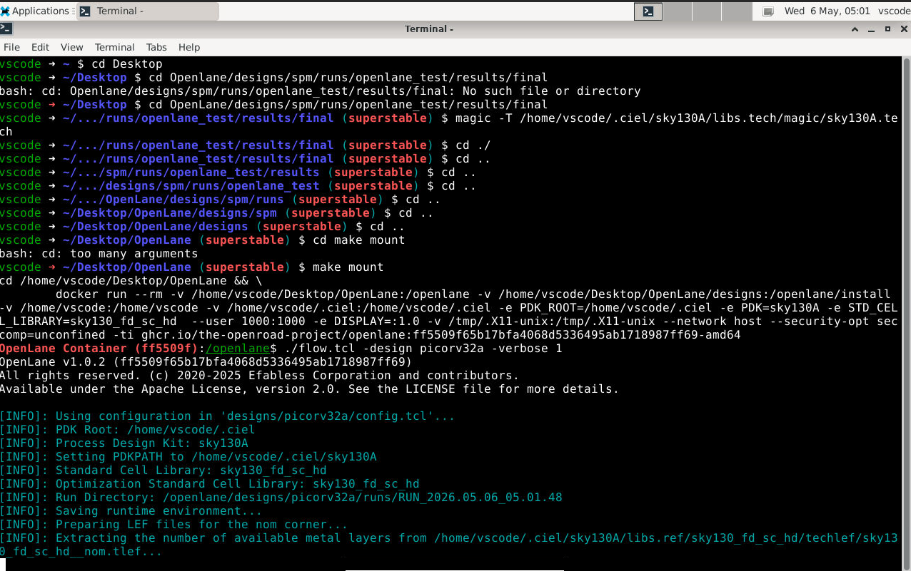

---

## 3. Final Layout Output

The OpenLane flow successfully generated the full physical layout of the `picorv32a` core.

This layout includes:
- Standard cells
- Routing layers
- Power distribution

The image below shows a zoomed-in view of the final layout.

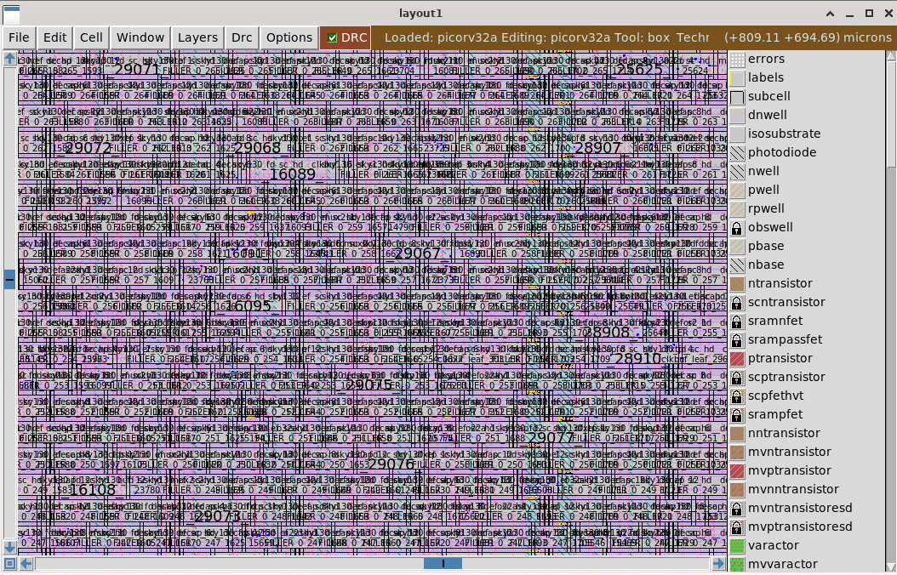

---

## 4. Understanding OpenLane Project Directory Structure

The structure of an OpenLane project was explored to understand:
- Where source files are located
- How configurations are managed
- Where outputs and reports are generated

Key observations:
- Verilog (`.v`) files define the RTL design
- `.sdc` files define timing constraints
- Multiple configuration layers exist

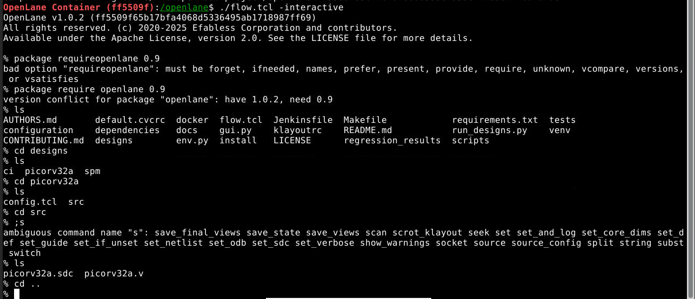

---

## 5. Configuration Priority in OpenLane

OpenLane follows a hierarchy of configuration files:
SCL_130A_config.tcl > config.tcl > OpenLane default config

Meaning:
- Technology-specific configs have highest priority
- Design-specific configs override defaults
- Default configs are used when nothing else is specified

---

## 6. Design Initialization using `prep`

The `prep` command is used to initialize the design environment.

It performs:
- Setup of run directories
- Preparation of configuration files
- Initialization of the flow environment

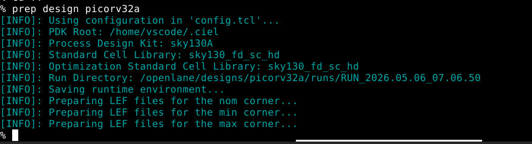

---

## 7. Exploring Run Directory Structure

Each OpenLane run generates a structured directory containing:

- `logs/` → execution logs  
- `reports/` → analysis reports  
- `results/` → generated design outputs  
- `config/` → configuration snapshots  

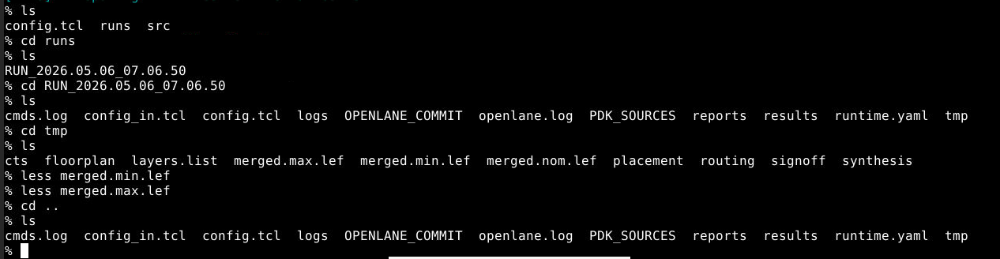

---

## 8. Configuration Snapshot in Runs Folder

The `config` folder inside the run directory contains all effective configuration values used during execution.

This includes:
- Default values
- Overridable parameters
- Tool-specific settings

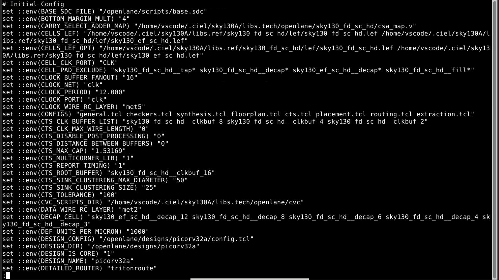

---

## 9. Synthesis Stage

The synthesis stage converts RTL into a gate-level netlist.

Outcome:
- Successful synthesis execution
- Generation of optimized netlist

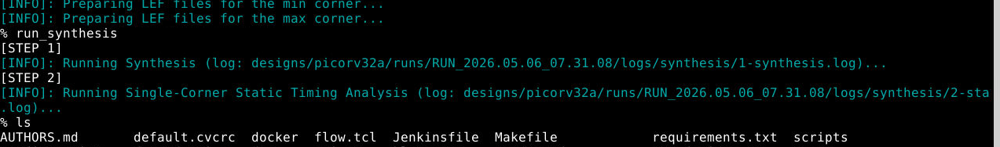

---

## 10. Synthesis Logs and Errors

### Error Log
Contains any synthesis-related issues or warnings (No errors).

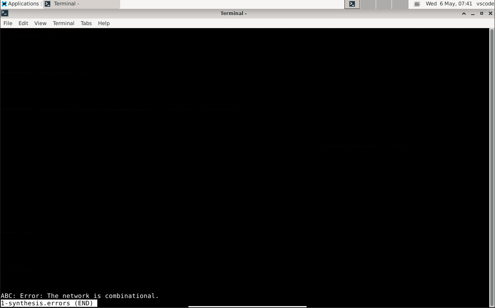

### Detailed Log
Provides step-by-step execution details of synthesis.

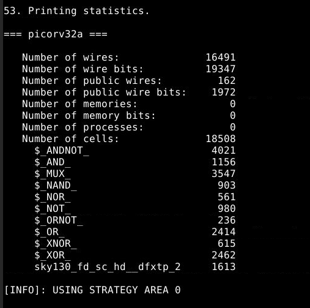

---

## 11. Area Analysis

The synthesized design area was evaluated.

Key observation:
- Total area consumed by the design after synthesis

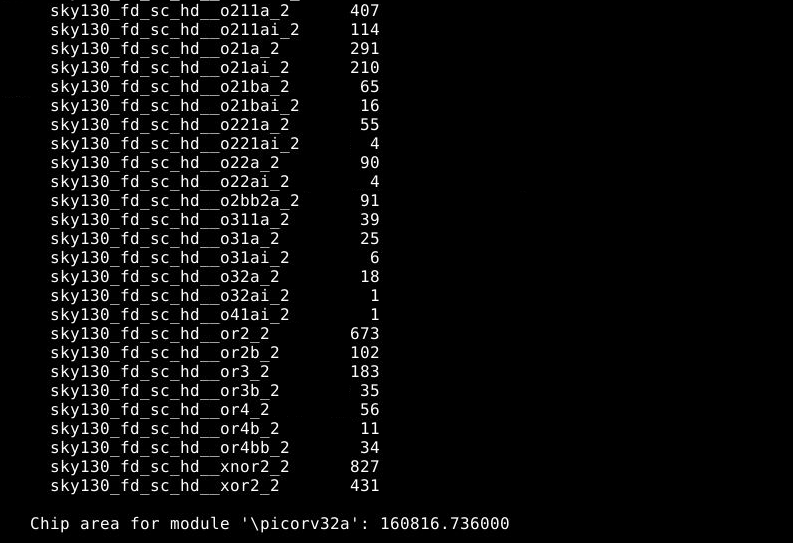

---

## 12. Flop Ratio Analysis

The ratio of flip-flops to total cells was calculated.

- Total number of cells = **15762**
- Number of D flip-flops = **1613**

### Flop Ratio:
Flop Ratio = (1613 / 15762) × 100 = 10.23%

This indicates the proportion of sequential logic in the design.

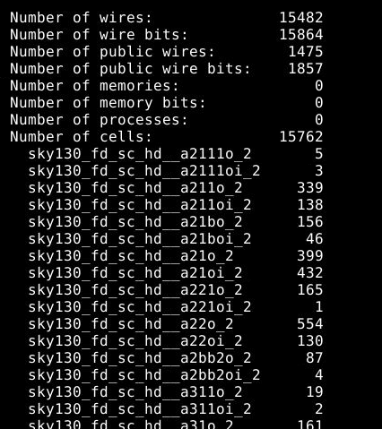

---

## 13. Mapping Results

Mapping results were analyzed from:
results/synthesis/

These include:
- Technology mapping
- Cell usage distribution

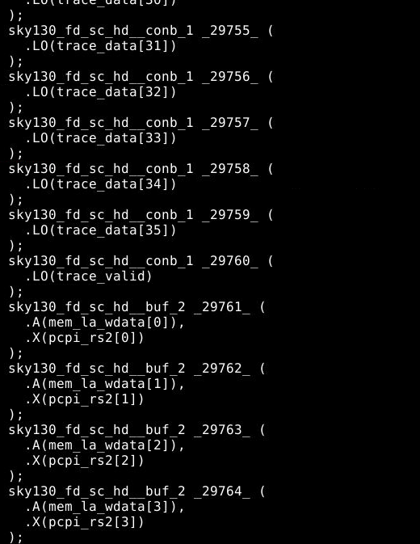

---

## 14. Area Report File

Detailed area statistics were obtained from:

reports/synthesis/1-synthesis.AREA_0.chk.rpt

This report provides:
- Cell-wise area contribution
- Total design area

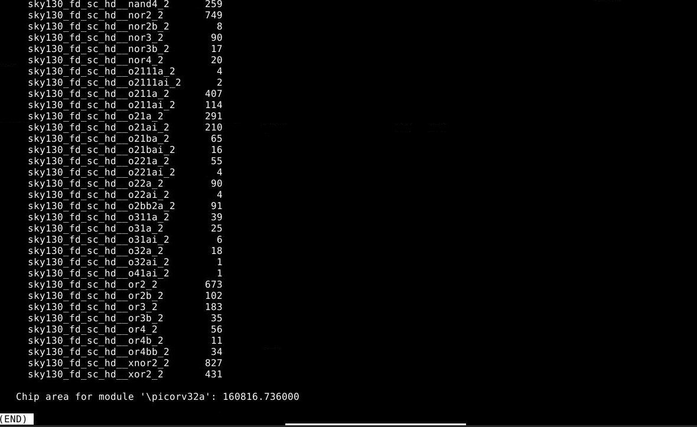

---

## 15. Timing Analysis

Static Timing Analysis (STA) results were examined using:

logs/sta/2-sta.log

This includes:
- Setup timing
- Slack values
- Critical paths

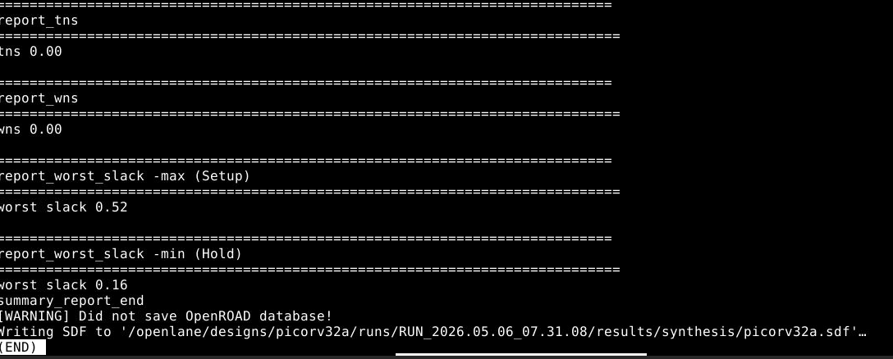

---

# Conclusion

In Week 1, the following were successfully achieved:

- Setup and validation of OpenLane in Codespace  
- Execution of a full RTL-to-GDS flow using `picorv32a`  
- Understanding of OpenLane directory structure and workflow  
- Analysis of synthesis results including area and timing  
- Exploration of configuration hierarchy and run-time artifacts  

This establishes a strong foundation for deeper exploration into physical design optimization and constraint tuning in future weeks.