Iterative flow in Openlane:-
To make Changes, You simply change the respective variables, and run the step again.

SPICE Deck:-

Define Component connectivity
Determine the values and parameters of each component
Identify the nodes and name them.
Nodes- connected wires with the same potential.

Syntax for PMOS/NMOS
= `<name> <drain> <gate> <substrate> <source> pmos/nmos W L`

This is simpler, its just the two terminals and its value

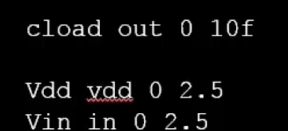

This is the simulation Command.
This describes a DC sweep of the Vin terminal from 0 to 2.5V.

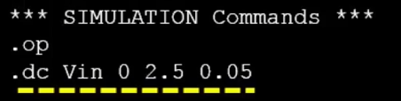

After defining the core aspects of the circuit, we need to link the appropriate model files for the components itself.

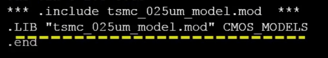

It has the description of all the parameters of the models.

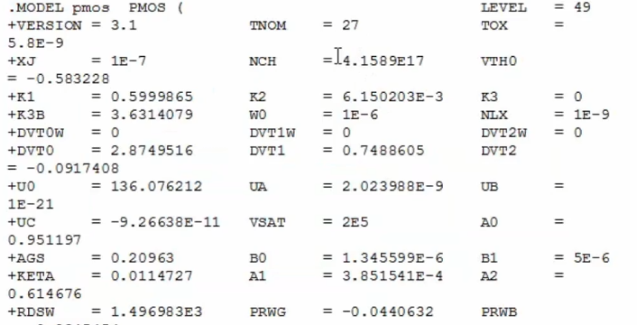

We can see the difference in switching threshold as the W/L ratio changes:-

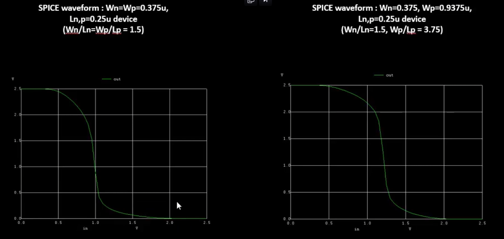

When PLotting the x=y line on this graph, which is basically the value of the Vin itself as this is a linear sweep, we can see that this linear line correlates with the output transfer characteristic line at roughly 1,1, which means that the switching threshold is 0.9V

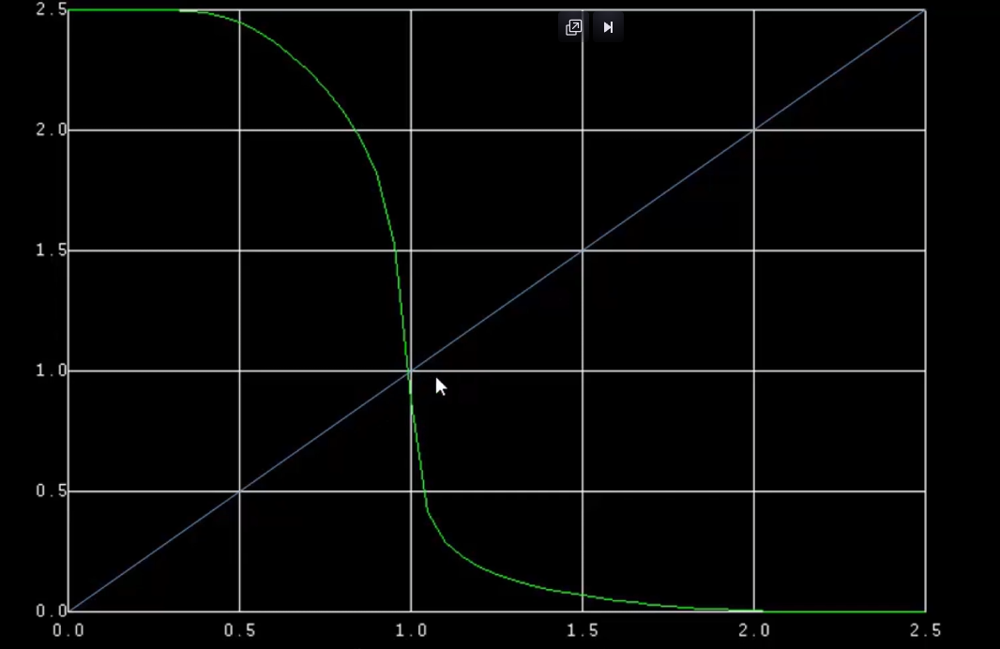

On the other hand, when the width of the pmos is manipulated, we can see that the switching threshold is roughly in the middle of the graph, which means its roughly 1.25V. This works because holes has lower mobility than electrons, this makes the switch to negative easier and the switch to positive harder, which is why we saw an earlier switch in the inverter.

In this region, both the devices are on, and hence the current directly flows between vdd and ground and hence, this is a big opportunity for leakage and should be dealt with by reducing the area.

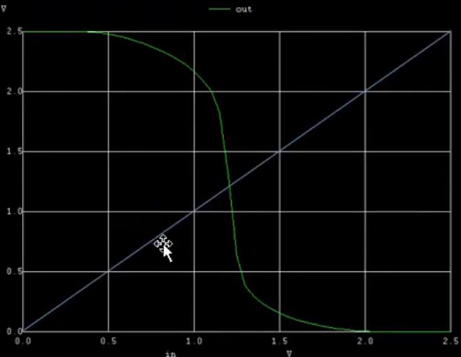

The Voltage has been changed to a pulse. This is the input. We can see the period, both the voltage levels, rise and fall times and the duty cycle in terms of on and off time has been specified.

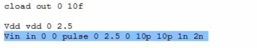

We have also set the analysis to transient to observe the changes of the output with respect to time

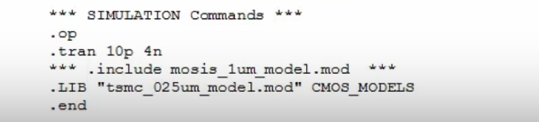

The graph is against time and we can see that the output obviously delays from the input due to capacitances but we can calculate the delays here by finding out when the lines cross 50% for its respective pulse.
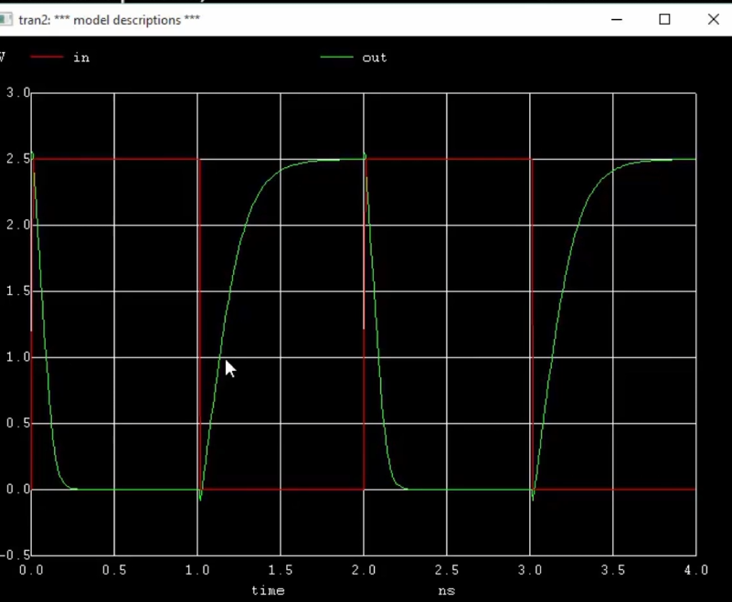

16-MASK CMOS Process

1)Select substrate
P type silicon substrate is commonly used for this.

Substrate doping should be less than the well doping.

40nm of SiO2
80nm of Si3N4

Deposit 1um thick photoresist.

Photoresist is basically like a camera film that can be used to etch out regions by only exposing specific regions

Mask is placed and UV light is shined upon, and the remaining photoresist is washed away. The mask is also removed.

Si3N4 is etched off, from the places not protected by the photoresist. Now the photoresist can be removed because the Si3N4 itself is a good shield when doping

We place the the entire substrate in an oxidation furnace. The regions that are not protected by the Si3N4 grows.

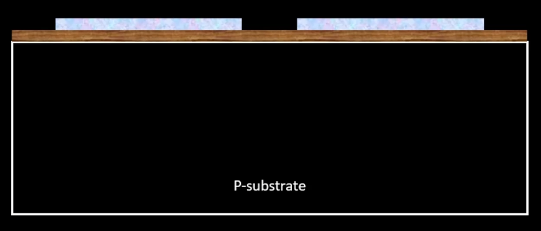

to 

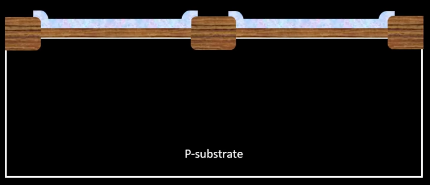

Now we strip out the Si3N4 using phosphoric acid.

To etch the layers of the N-well and the P-well, we use Mask 2:-

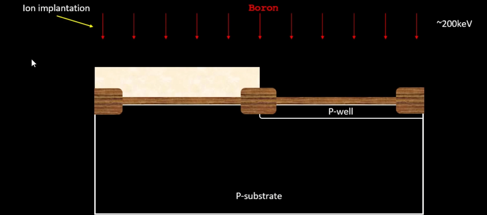

The mask is used with photoresist again and boron is is shot with an ion implanter and the regions not covered by the photoresist is doped P type.
A high energy is needed because boron needs to go through the oxide layer and dope the p type substrate. 

This can damage the oxide layer, however be repaired later.

The same process is done on the other side to etch in the n-well

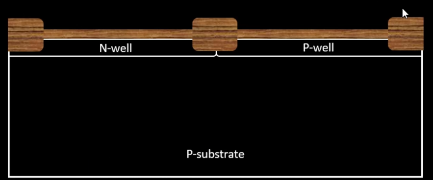

This is then put in a high temperature furnace which will energize the boron ions and they will diffuse further into the substrate making the well deeper.

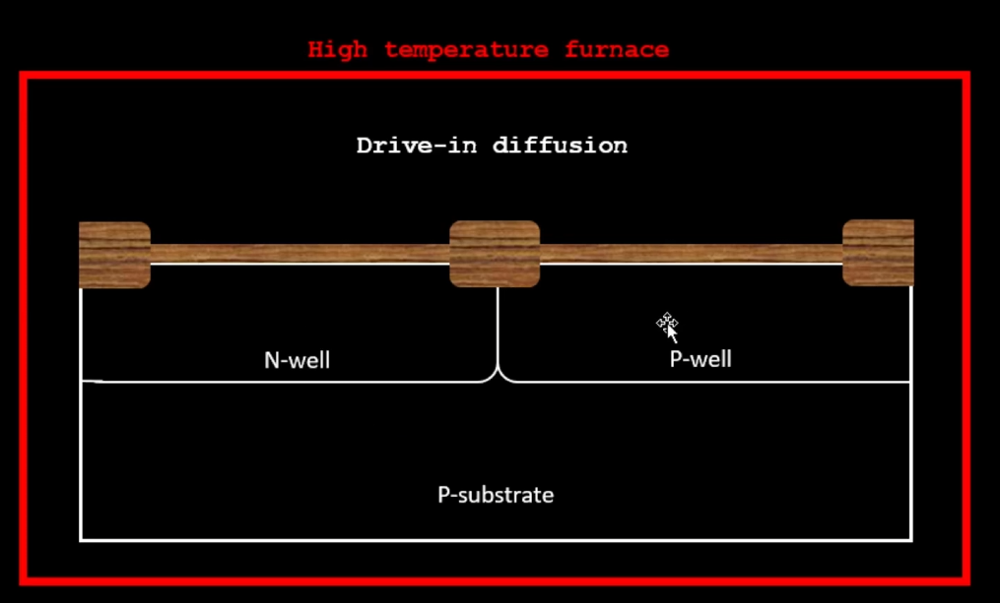

The doping concentration and the oxide capacitance can be varied to control the voltage thresholds on the substrate.

Mask 4 is used to ion implant boron into the substrate and this is done with lesser energy as before because this is meant to be the gate and hence it should only be at the surface and not any deeper.

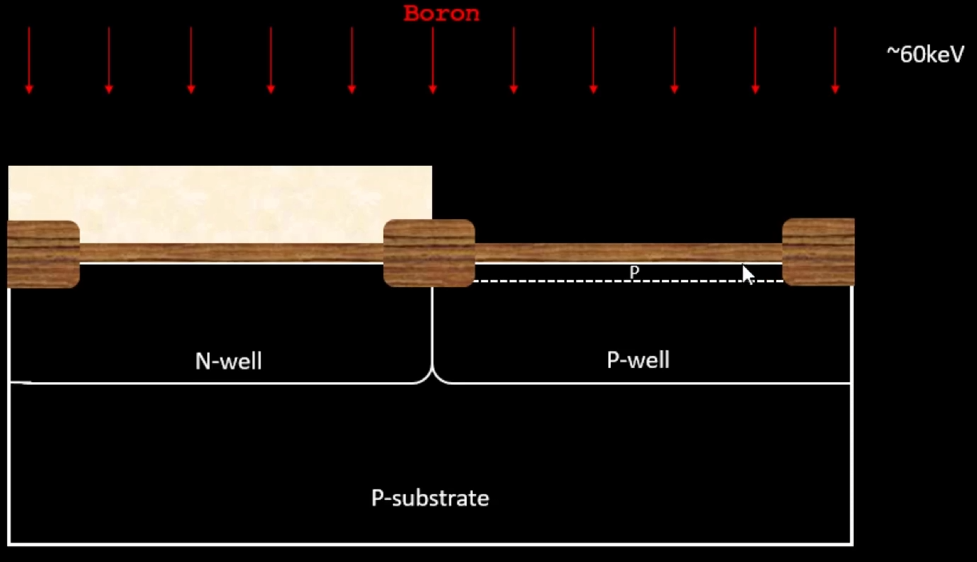

The vice versa can be done for the other side of the CMOS.

Arsenic is used for the Nmos N gate doping.

Hydroflouric Solution is then used to etch off the remaining silicon oxide layers. and then oxide is grown again. This is because the oxide would significantly weaken from the ion implantation process.

Even though in theory an ideal mosfet is meant to be symmetrical, we can change the doping concentrations of the drain and source for better performance.

Lightly doped drain formation
Why do we need Lightly doped drain:-
Hot electron effect
Short Channel effect

Hot electron effect
High energy carriers can end up killing Si-Si bonds which is a huge problem. This would slowly degrade the lattice with further and further use.
Another issue we could be facing is the 3.2eV barrier between the Si conduction band SiO2 conduction band. If the electron has a lot of energy, it can just cross this energy gap entirely.

Short Channel effect
When the channel or the gate becomes so short, the drain's electric field can actually penetrate the channel disturbing the capacitance induced votage of the channel, making the transistor to misbehave. 

Mask 7 - used for ion implanting the N and P well using dopants phosphorous and boron

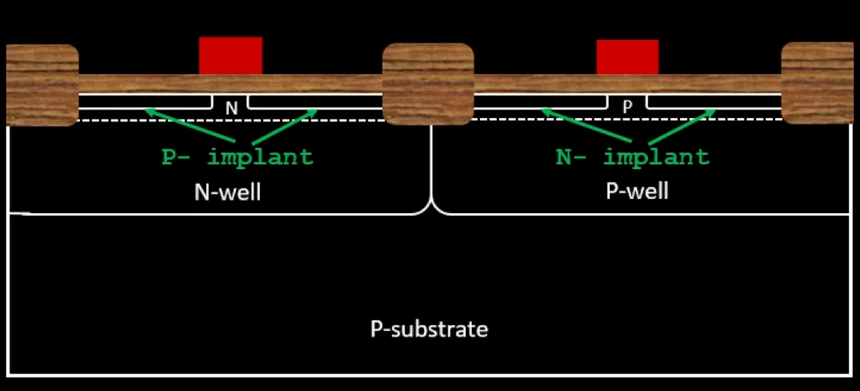

Thin screen oxide to avoid channeling during implants.

Mask 9 with arsenic at 75keV.
and Boron at 50keV

Titanium is applied on the wafer surface using sputtering:-

Titanium is placed next to the wafer and it bombarded with inert gases like argon, this knocks titanium ions out of the metal surface and on the wafer surface. Wafer is then heated. The result is the Titanium binding with the silicon everywhere but the regions that are directly exposed to the doped silicon.

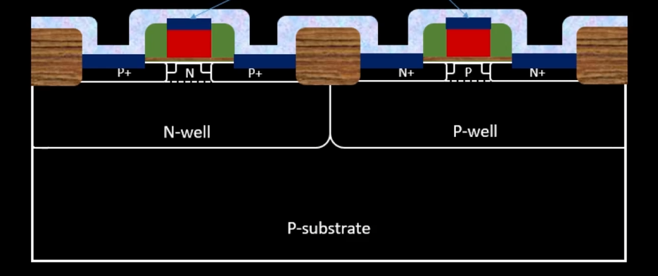

We then take a photoresist layer very thick and use RCA cleaning

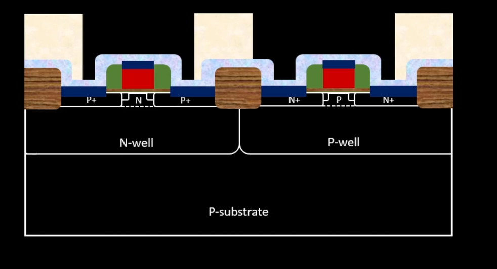

This will finally etch in the TiN

Deposit SiO2 doped with boron and phosphorous. This layer is decidedly thick.

Chemical Mechanical Polishing is used to planarize the wafer surface. 

Etch out the SiO2 for the higher layer metals formation.

We use TiN deposition and CMP again to add the metal pins

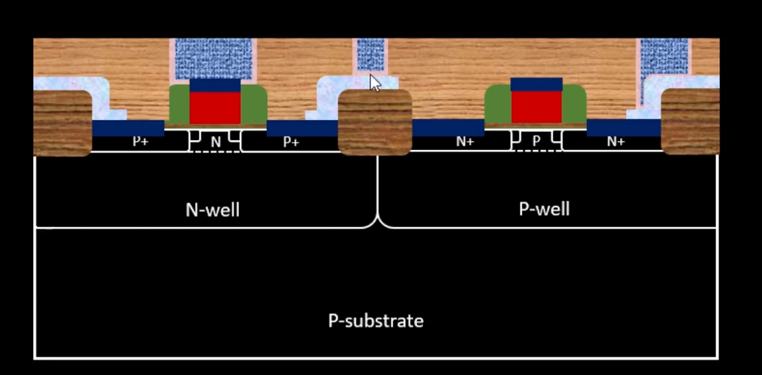

We add Aluminum and plasma etch it.

For higher levels, We etch SiO2 and use more contact drill holes to fill TiN.

Layout on magic:-

You need to know the lower left x,y and upper  right x,y, thats all you need in order to setup the  grid

The full layout is here. Done by copying the tech file to the working directory of the spice folder and then running the layout on magic. 

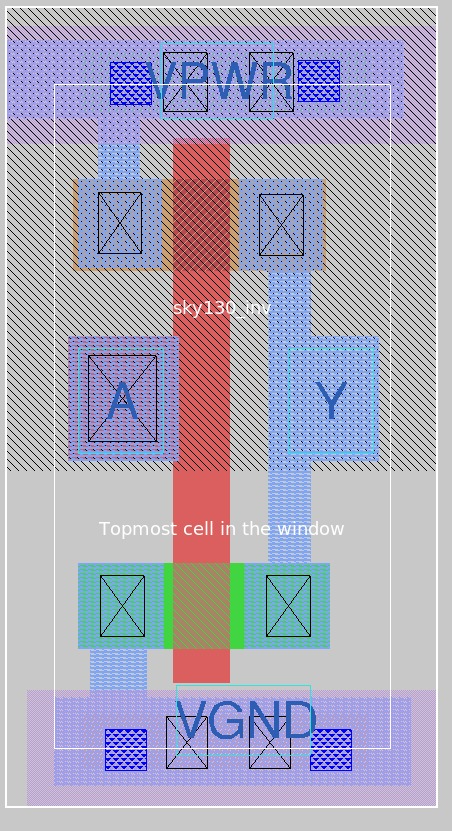

Once the layout is up, we can extract the parasitics and create the spice file of the same. 

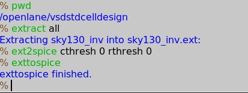

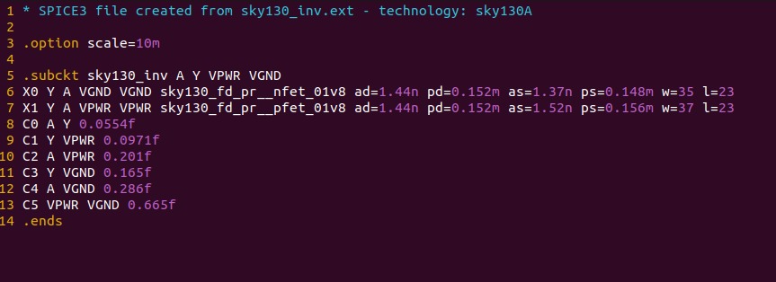

However, The spice file has been modified to do some simulations. This may not allign with the tutorial either due to the mismatch between the definitions of the pshort and nshort .spice files used in the tutorial and the different technology requirement i was expected to provide.

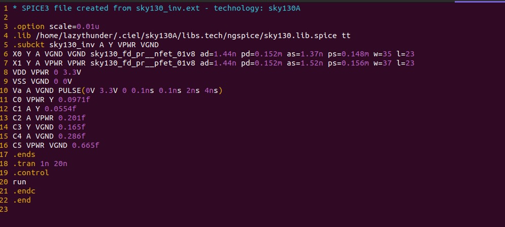

the code itself is identical other than the includes though.

The successful run of the layout.

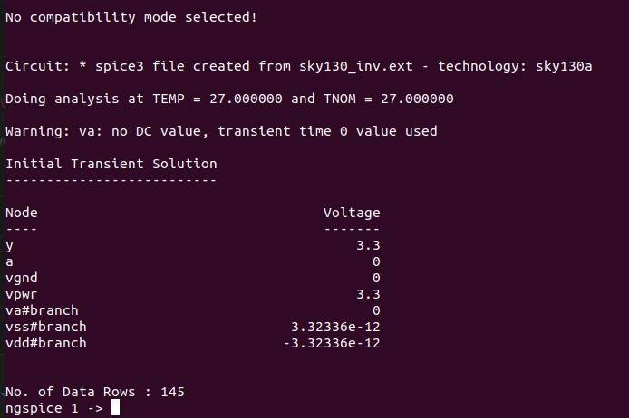

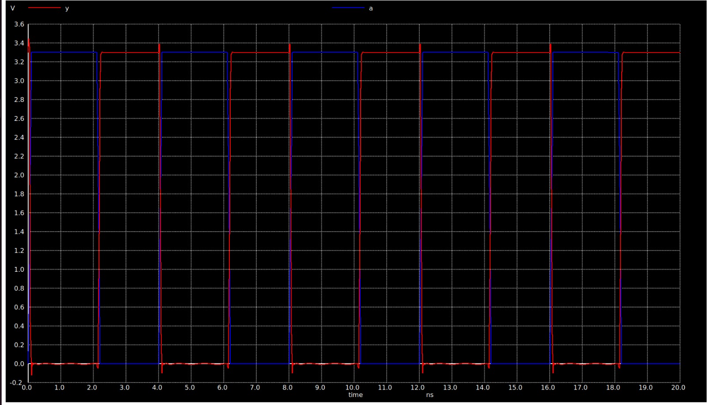

