Creating the lef file to attach to the picorv32a model

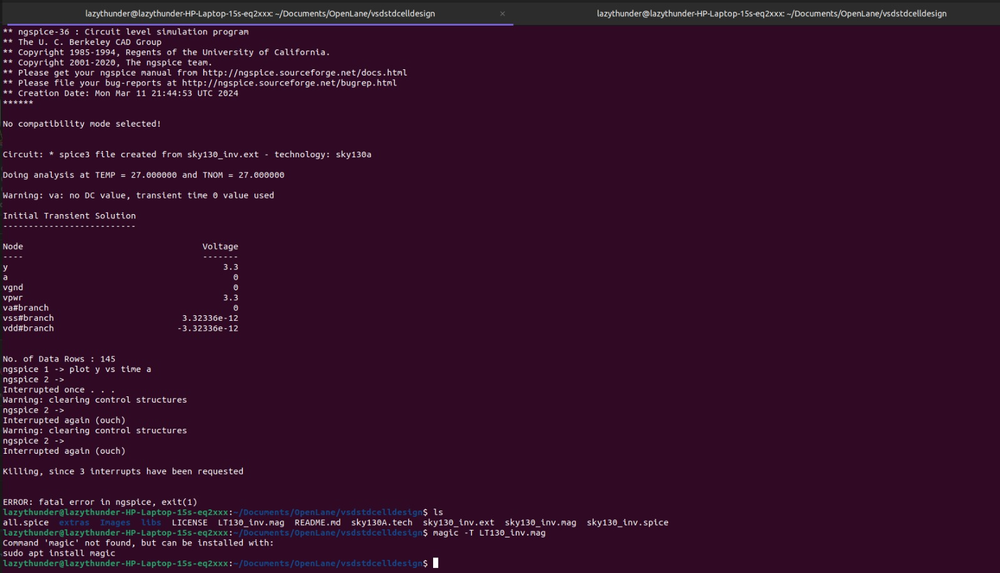

After making the custom layout, the layout  lef and .lib files have been copied to the src location where they will be used to be linked up to the design itself
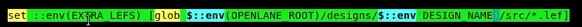

The config has been modified to include the new lef files:-

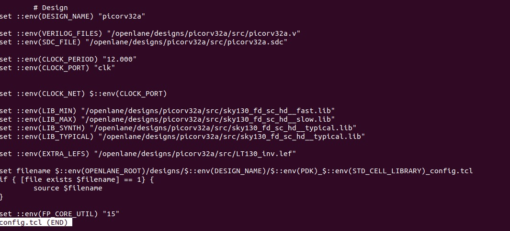

The lefs have been linked by using the CLI interface.

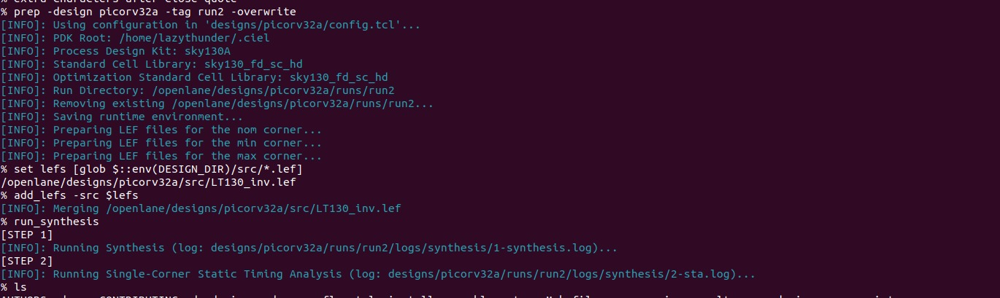

We can see that the new Design has been incorporated into the flow successfully(LT130_inv)

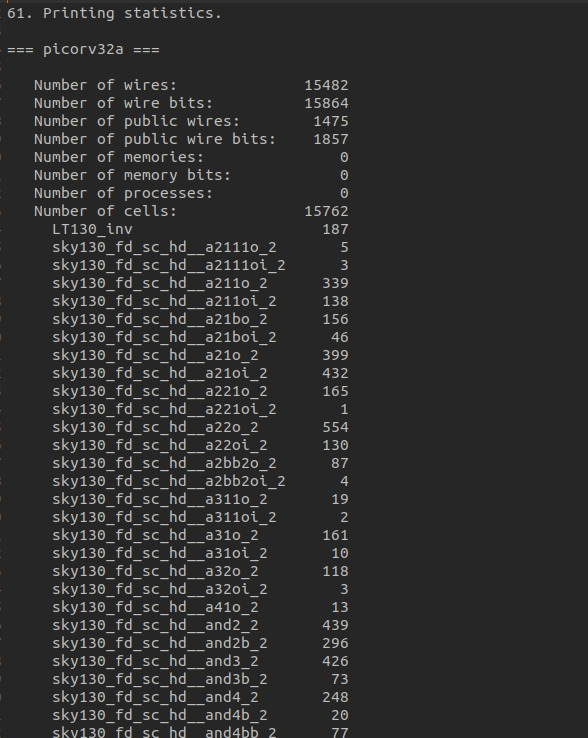

There are no slack and timing violations of the design:-

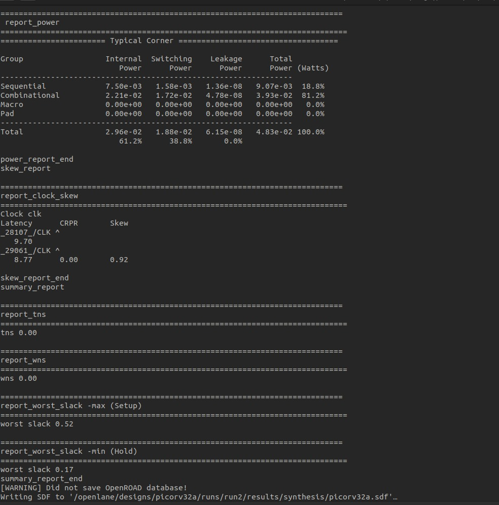

Power Gating CTS:-

And or Or gates can be used to gate the clock signals

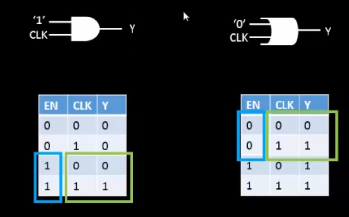

Each element was taken out of of the circuit, given a series of input slews and output capacitances and figured out the delay for that

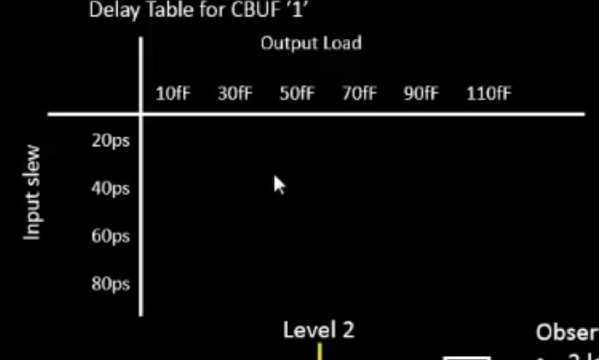

By changing the Lef file for the inv, I did not notice a change in delay despite having conclusive proof for incorporating the custom inverter file.

However, there was a huge delay and slack violation seen in the tutorial. The following is not me following but rather just learning how to deal with such slack violations as this would be my first encounter of it.

Step 1) Go through the synthesis variables.

one variable we could tweak is the Synth stragtegy variable. 0,1 are delay oriented while 2,3 are area oriented.

Synth_buffering - adds buffers to drive high fanout pins with higher driving power.

Synth_sizing - up or down sizing buffers to optimize for area and compensate for weak driven signals.

Synth Driving Cell - cells driving the inputs.

After the current changes, we can see that the area has increased, likely as a result of the synth strategy variable.

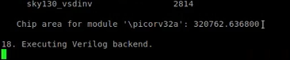

The worst and total slack has fallen drastically, proving that taampering the variables has worked. It is still on the downside and needs more fixing.

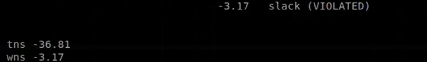

Static timing analysis:-

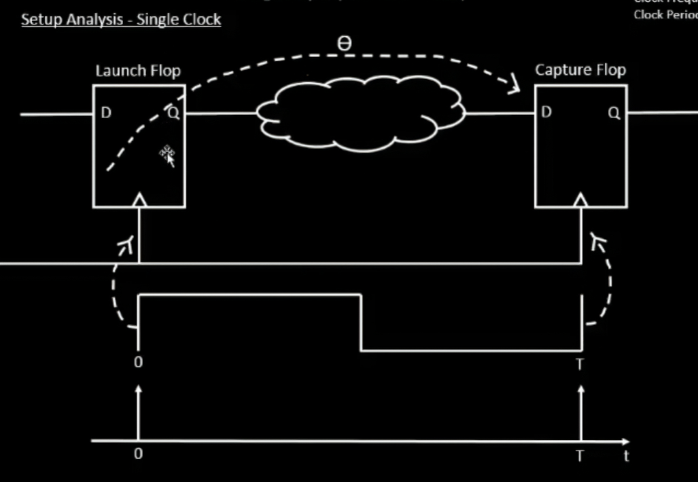

In this case, there is a launch and capture flip flop, and there is a combinational logic in between. So any signal that comes into the circuit has to arrive at the D port of the launch flop, pass hold time, wait for the clock, propogate through the launch flop, exit through the Q port, go through the combinational logic and repeat the exact same process at the capture flop. All within the given time period T.

A D flip flop is basically two muxes. At time 0, when the signal and clock is introduced into the circuit, A small delay is added to the signal between D and Qm. When clock is shifted from logic 0 to logic 1,

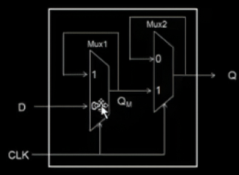

Now for the OpenSTA run.

Originally the run was done with the pre_sta.conf file and a base.sdc replicated from the tutorial.

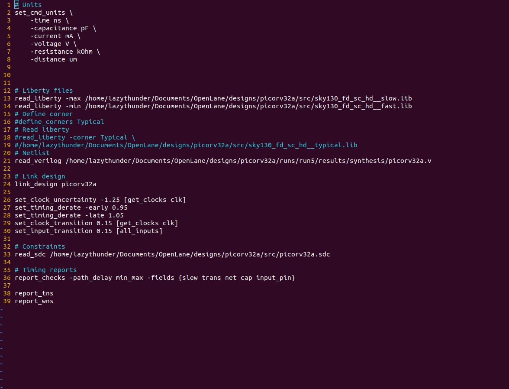

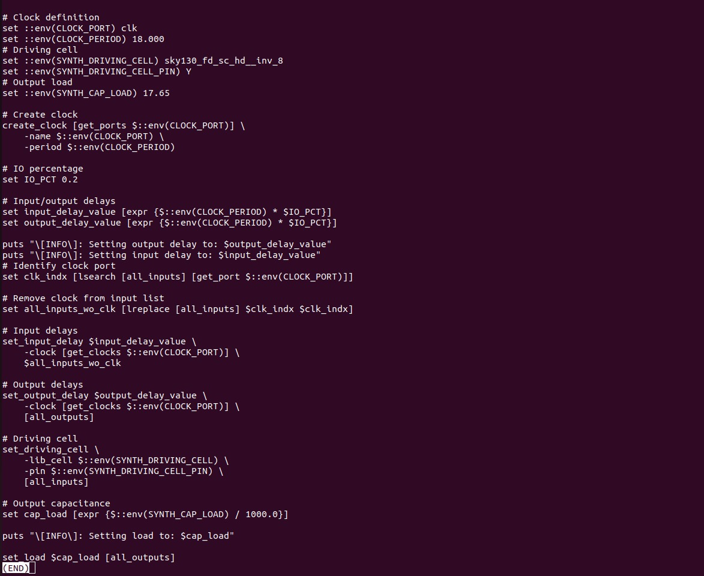

However, this run failed with a huge slack violation.

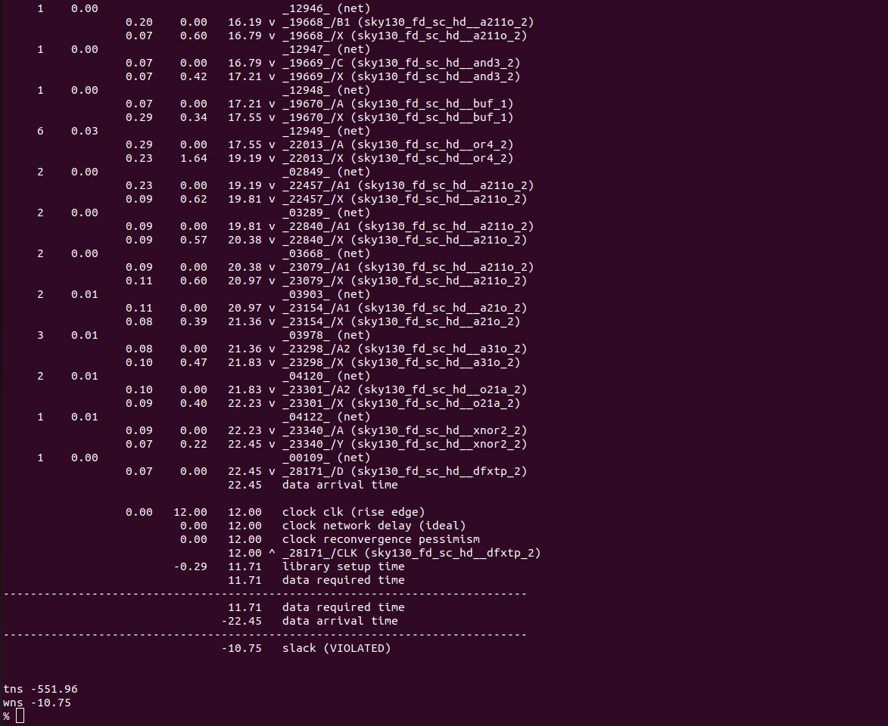

But the Openlane's STA reported a 520 slack margin

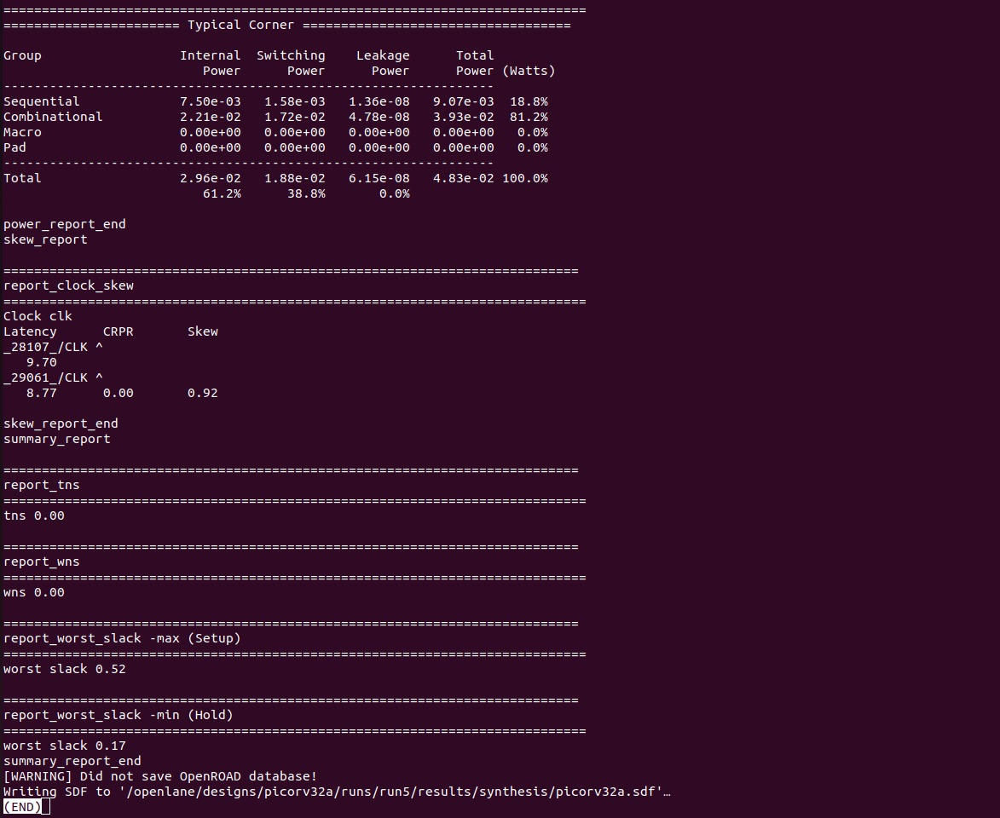

But after debugging, I figured out that both the implementations were using different corners. The STA look a more pessimistic approach and tried to use the slowest library for slack and the fastest for hold, the most pessimistic case possible.

After changing the .conf file in order to use the typical corners instead... 

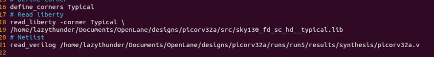

I ended up with this.

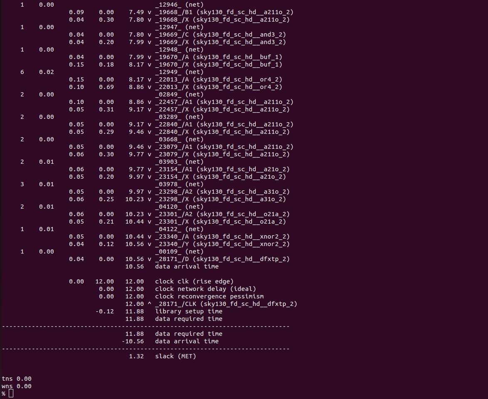

This however was not convincing, the difference was still roughly 2.5 times, that is not normal. And then after more debugging, i figured out that openlane adds some non ideal effects on its own and OpenSTA being a fresh run lacked all of this. So I added these variables with the values seen from the openlane sta reports to make up for the difference.

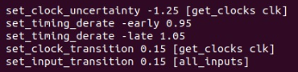

finally, the difference dropped to something reasonable.

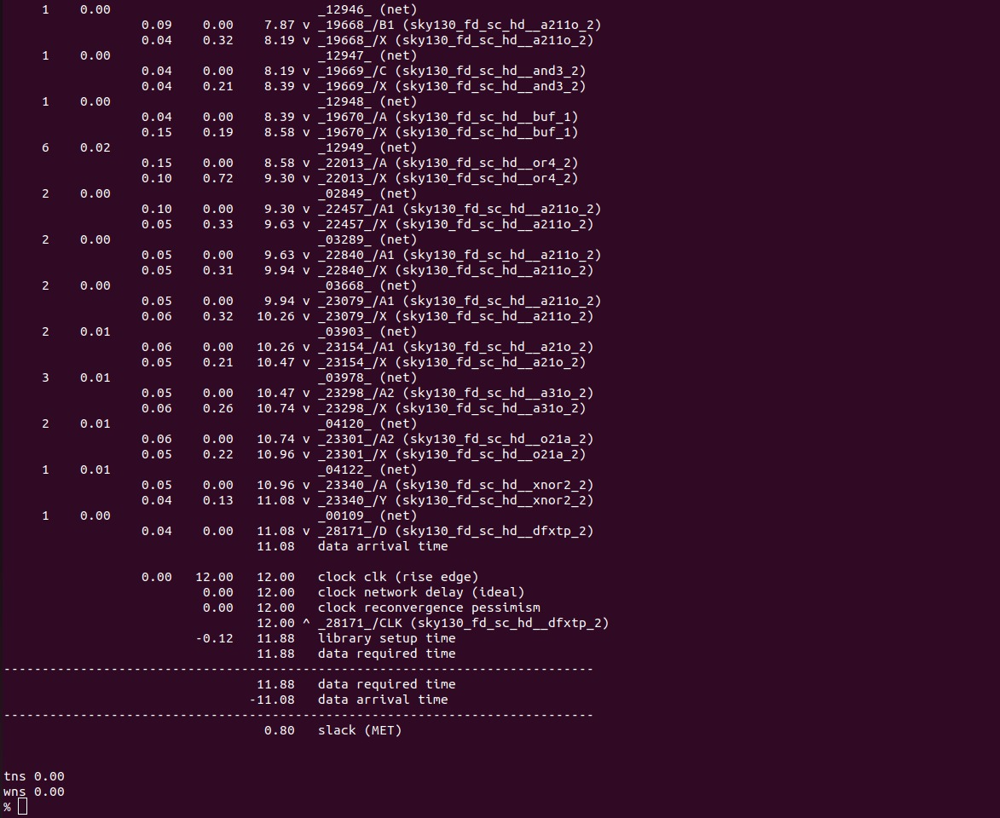

The remainind differeences originate from even more parameters mismatching but since the difference is a lot less significant, I ended my debugging here.

in the tutorial, we can see that the negative slack is controlled by reducing the fanout. However, in the tutorial, they did manage to get identical timing reports which makes this easier.

Here we are seeing the STA's CLI at work. These could be helpful to modify a rogue timing error.

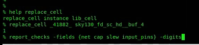

In this flip flop clock provision, t2 will be greater than t1. This is due to very obvious reasons. The wire leading to t2 has higher capacitance and resistance due to the fact that it is longer.

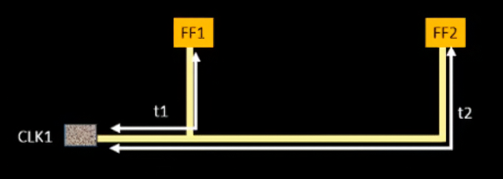

The difference between t1 and t2 is called the skew and we usually try to minimize this. This is done by introducing intentional delays in shorter circuits.

To build clock networks that has less skews, we build something called the H-tree. This is done by splitting the clock signals many times in equal lengths to make sure that the recipient cells receive clock signals very close to each other. 

It is to be noted that clock skew and clock delay are usually inversely proportional

The clocks actually end up with a decent amount of slew loss as they pass through long wires inside the IC. This is why the clocks need to be buffered and repeated. 

Timing reports change dramatically as these non ideal clocks are taken into account.

Clock net shielding:-

In order to make sure that cross talk does not decimate vital clock signals, we need to shield it. 

Let's assume that a strong aggressor is transitioning its state. A glitch can cause this to couple with a victim wire which will record a temporary dip in voltage. If this happens in a crucial line like reset, it might end up disorienting the entire unit from the Chip. And in general, it would take each of these signals significantly longer to converge as they have to account for all these possible glitches before the next clock cycle begins.

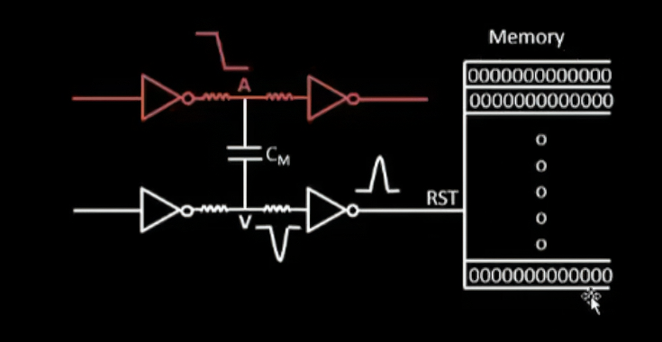

Here we can see a representation of the aforementioned glitch resulting in cross talks when both the lines are trying to transition at roughly the same time. This negatively impacts slew and adds unnecessary jerks to the signal transition. We try to avoid this.

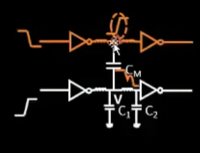

Successful run of CTS or clock tree synthesis:-

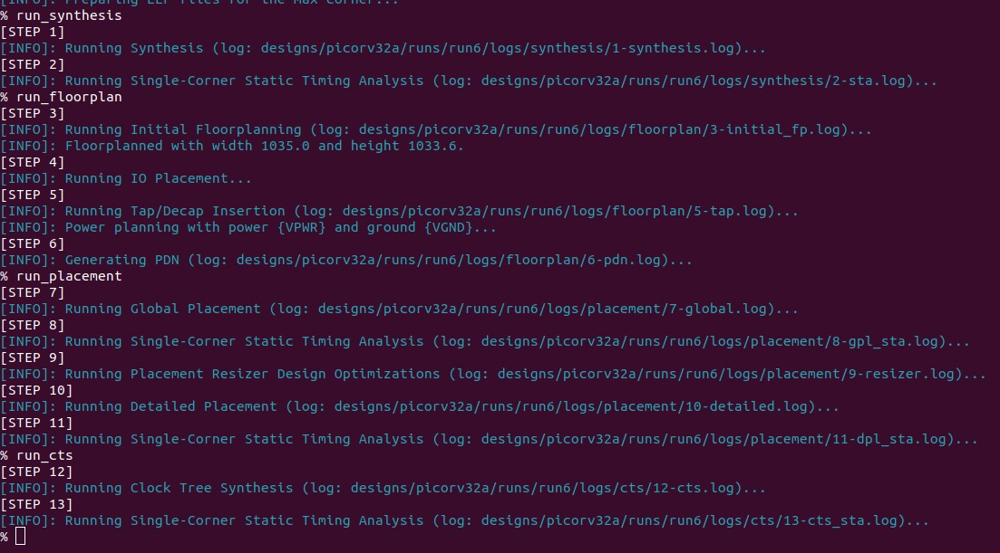

timing report of the same

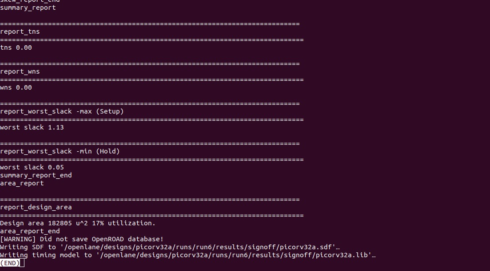

We are now seeing behind each of these commands. run_cts for instance is enabled by a single command but has a lot of steps that it follows in order.

To see this, we head to OpenLane/scripts/tcl_commands where we see the commands native to each of the steps in the rtl2gds process.

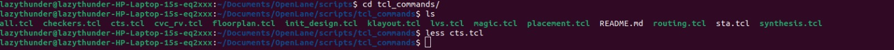

If we open any of these files, lets say cts.tcl for instance, we can see that the command itself is a 'proc' or a procedure. This can be thought of as a function. It is called procedure instead of function as the language itself is extremely old and uses older notations. Note that tcl was created in 1988.

The tutorial asks us why there is no synthesis.tcl for instance in the openroad folder. But I am given a few moments to brainstorm. I believe it is because synthesis is not one of openroad's functionalities. I specifically remember using yosys for running the synthesis so it cannot possibly be under openroad.

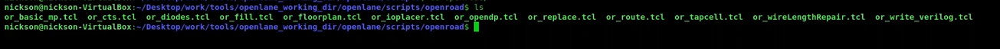

I seem to be right!

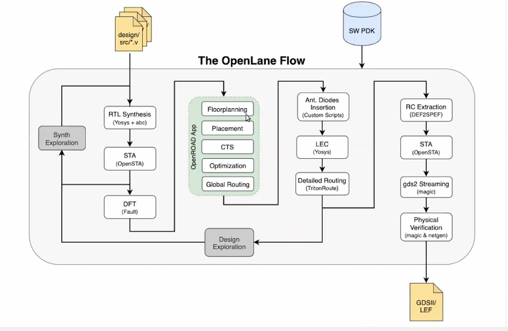

Hold Analysis:-

Hold condition states that the combinational delay should atleast be of some value x for which the clocked elements require stability.

The time taken in the mux2 to send the data from Qm to Q is called the hold time. The flip flop as a whole needs to maintain the same data levels during this situation when the muxes are in analog limbo. If not, the flop could fall into metastability where we dont know what the state of the flop could be for certainty.

We continue doing the STA flow which is incorporated in openroad UNDER openlane

Why?
by using this configuration, we never leave the openroad flow and hence we can use all the environmental variables that are endemic to the openlane flow that we cannot otherwise.

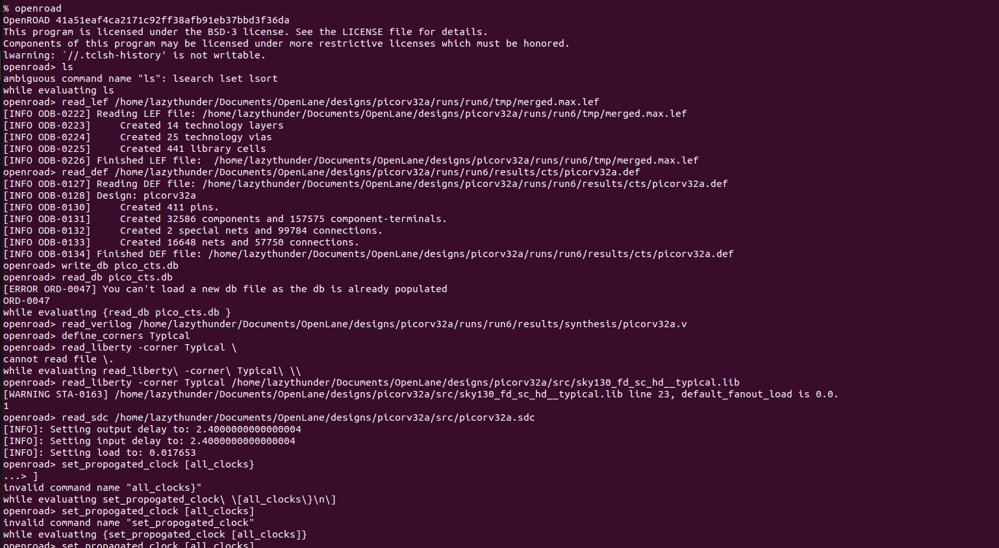

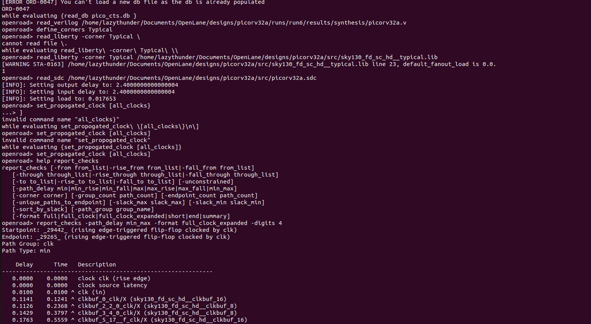

The list of buffers has also been modified to remove the weakest one on the first run itself(because I read the word doc first)

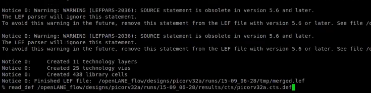

The slack ended up becoming better after this. My understanding of this situation is that before CTS, the clock tree doesnt exist yet but to run the remaining logic, pessimistic estimations and assumptions are made by the earlier tools in order to do their respective functions. When the clock tree is finally built, the actual tree is usually less pessimistic than these assumptions and helps our timings

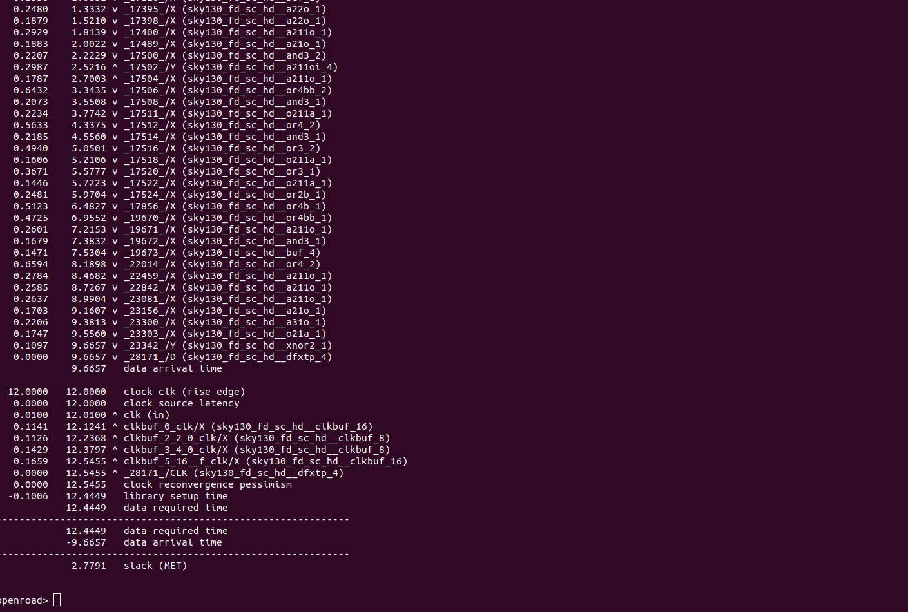

