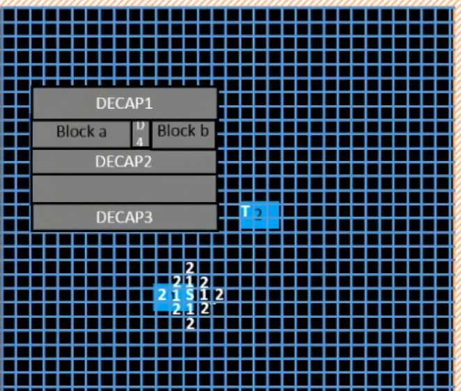
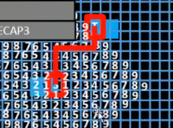
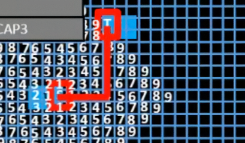
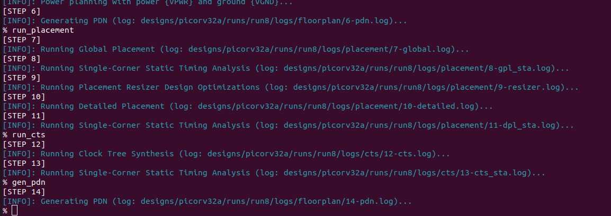
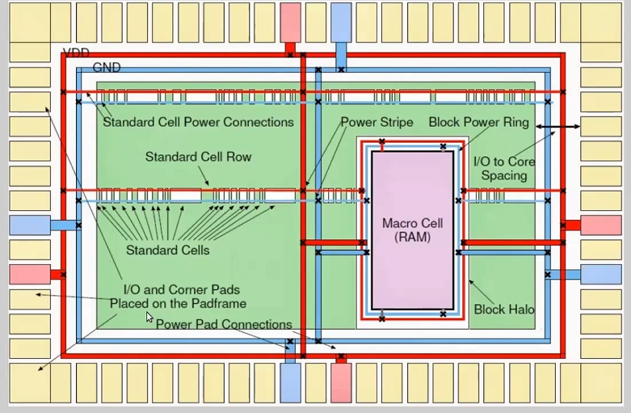
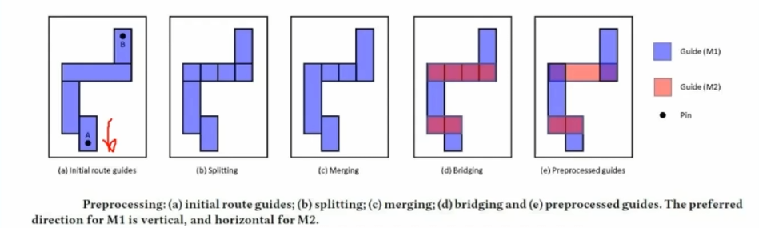
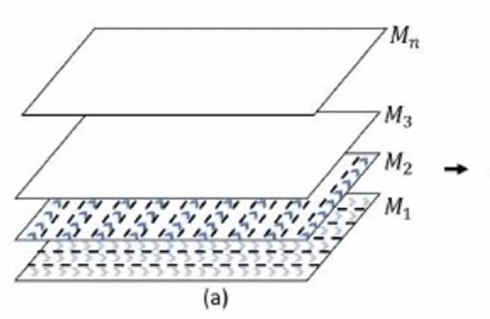
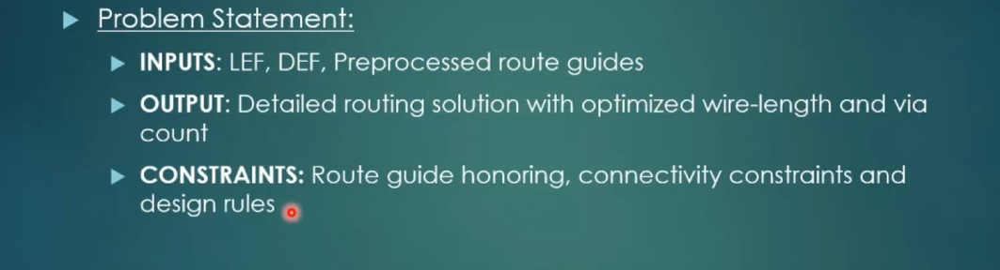
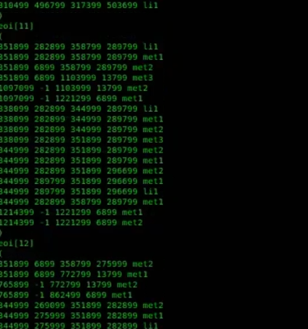

Routing :-

Connecting two points optimally.
Lesser turns are necessary as thesse add unnecessary resistance and capacitance.

The nature of the cell is mostly abstracted when determining the routing algorithm. 

We assume a very granular grid usually with relation to the smallest feature size of the process. We create a 'heatmap' of sorts and find out what the geometric distance between the cells are by numbering the cells based on its distance(in grid squares) it needs to cover to reach.

At the very end, we just trace the numbers in ascending order and end up with a number of path options

Another possibility:-

But we can see that in the second option, we only do one turn, hence it is more preferable.

Another thing to note is that this is an extremely computationally expensive process. Creating a grid and assigning numbers and then tracing them in ascending, not once but multiple times for a single route takes enormous run time and memory.

Design Rule Checks:-

Rules that should be followed to ensure a proper fabrication.

Min wire width - is described usually due to the limitations of optical lithography itself as a light of certain wavelength can only guarantee a certain minimum feature size. If the wire is thinner than this, the light may not be able to properly fabricate this and you might end up with overlapping(shorted) wires or ambiguous behaviour.

Wire Pitch - The distance between two geometric centres of the wires is known as wire pitch

Wire Spacing - the distance between the edges of two chips is known as Wire spacing.

A signal short is considered a DRC.

How does the DRC tool know if the wire was intended to short or not? - multiple inputs, verifies against RTL.

Upper metal layers are thicker.

The power distribution Netrork generation:-

The Green part is the design. The yellow, red and blue rectangles are the IO Pads. We are using multiple red and blue pins, multiple power pins to ensure power supply. The crosses are vias.
The voltage is supplied to the rings and the grid is made inside the power ring. For every row, the power is via-ed down and connected so voltage can be supplied for the cells.

If there is a macro, we usually assign smaller power rings around that too and do the same process again, but with thinner wires.

Routing is divided into global/fast route and detailed route where the actual routing happens. This is done because the solution space is enourmous. 

Fast route - global routing tool
Triton route - detailed routing tool

Detailed route tries to follow the preprocessed route guides. These are usually obtained from the global route.

The routing is done on an intra layer parallel and inter layer sequential basis for run time optimization.

We can see that the initial route guides given to triton route just defines how the route could be. It is described in corridors. Fast Route then, splits this corridor into cells, and merges to see how optimized these corridors actually are, and then bridges them.

Merging - The routing guides that are orthogonal to the PREFERRED routing direction, as per the initial route guides determines how the merging is done.

The edges that are in the opposite direction to the preferred direction are bridged. The Non preferred direction is given it's own metal layer now where its the preferred direction for that layer now. 

The blue lines are called panels and they determine how the routing is done across that layer. these panels are the regions in which wires can be fabricated. Vertical and horizontal panelled layers are alternated so that signals can propogate freely across the die. During runtime, the odd numbered layers are all determined in on parallel sweep and all the even numbered layers are routed in another parallel sweep.

Triton Route :-

Triton route has three fundamental problems to solve with each route 

Triton is expected to connect the wires on from an lower layer to an upper layer with vias

Triton is expected to route the wires on the same layer to its respective vias

Triton is expected to route the upper layers to the lower layers.

(The first and third statement are not the same because the challenges fundamentally change depending on going from up to down or down to up because of the difference in thickness between the layers)

The structure of the fast route output file - The numbers are in order (lower x, lower y, higher x, higher y)

