# WEEK 2 — Toolchain Mastery and ORFS Execution

I have done the following flow as well on my local machine for the same reasons as before:-
- more compute
- lesser latency

---

# Openroad installation success:-

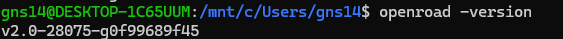

There were a lot of dependencies missing from the original binary. I had to install git lfs to install the actual files from the pointers after that point. However, even this would only yield me the Openroad installation and I had to install yosys separately. Python and make came with the openroad installation itself though.

---

# Python and Make successful installations:-

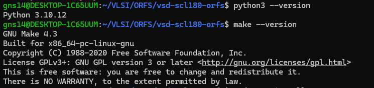

---

# Yosys installation:-

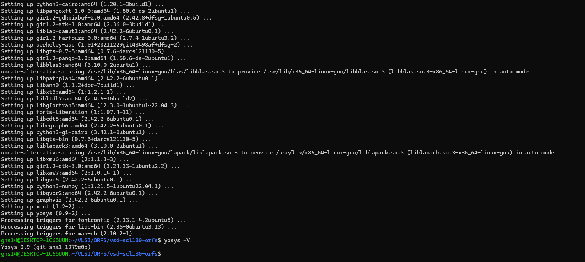

---

# The make command successfully ran and resulted in this

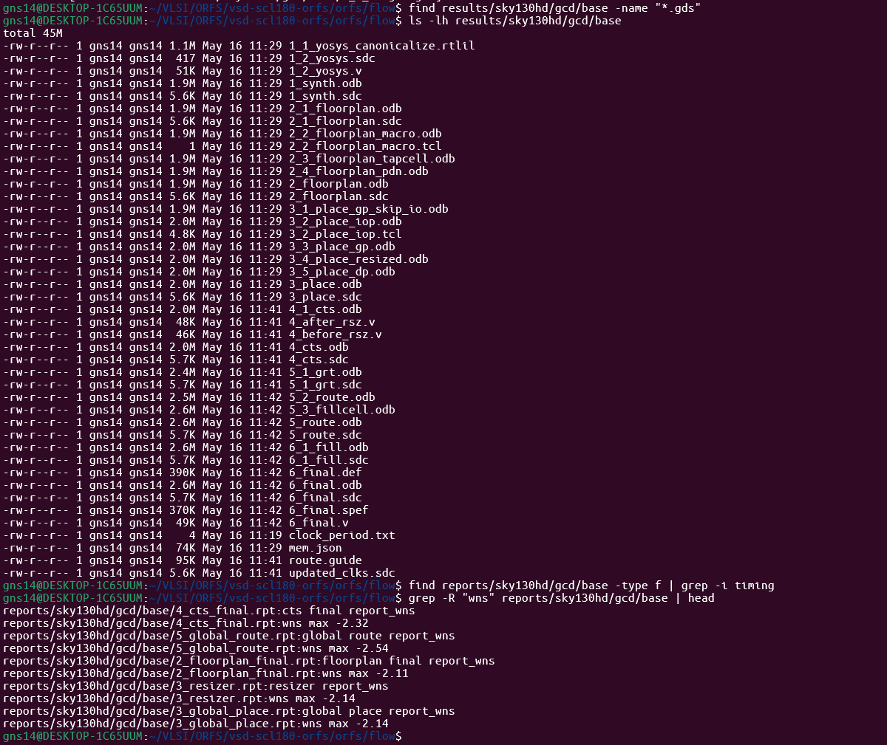

---

# The final layout can be seen here

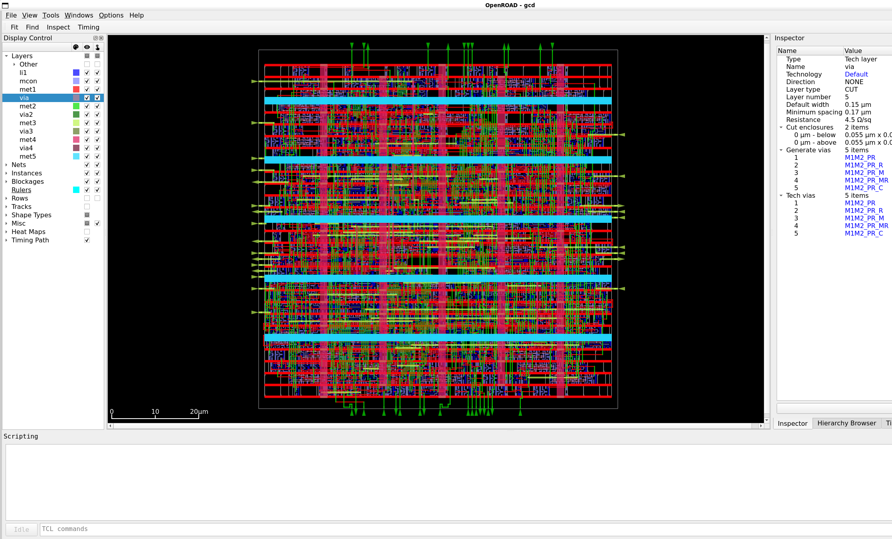

---

# Phase 1,3:-

## Terminal outputs of all the tools used in the flow

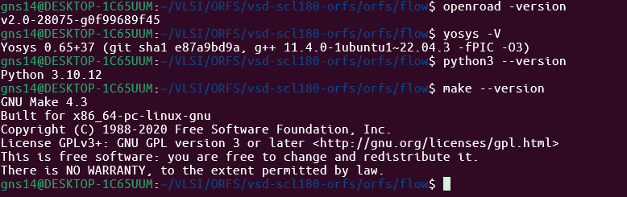

I got an error due to the absence of eqy.

EQY is an equivalence checking tool for verifying that the physical layout aligns with the logical schematic. Since the tool was missing, I did end up having some errors, then I pulled the tool manually from git where the tool expects it to be, as seen from the errors and warnings. And then the tool ran entirely.

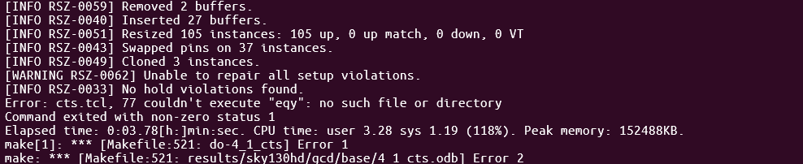

Notice the lines:
`couldnt execute eqy, no directory or file found`

After I got this error, I cloned the git.

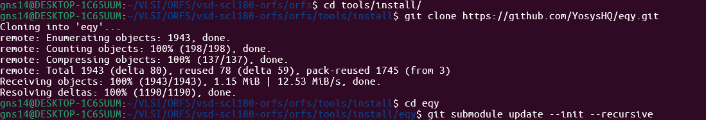

---

# Phase 2:-

## Proof of each step of the run:-

### Synthesis

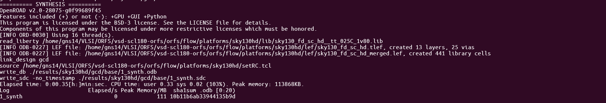

### floorplan

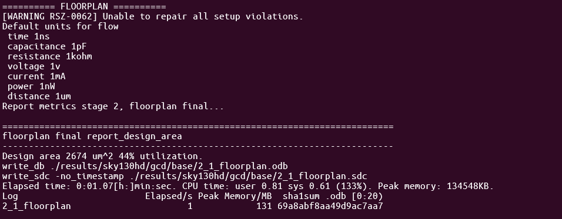

### placement

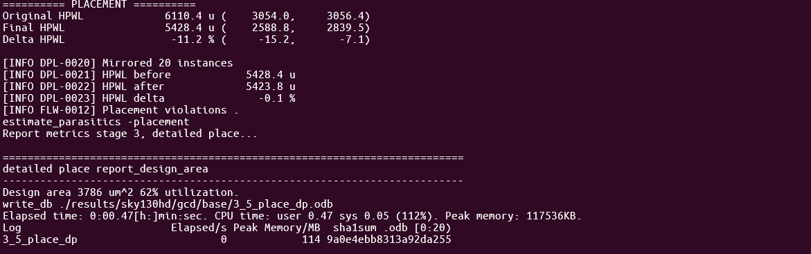

### cts

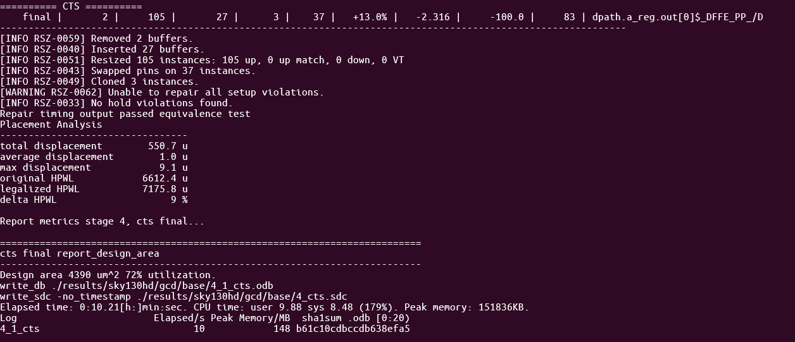

### routing

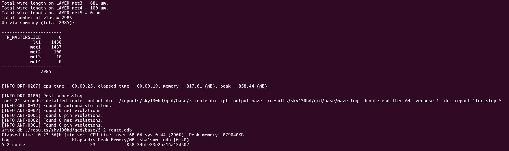

### timing

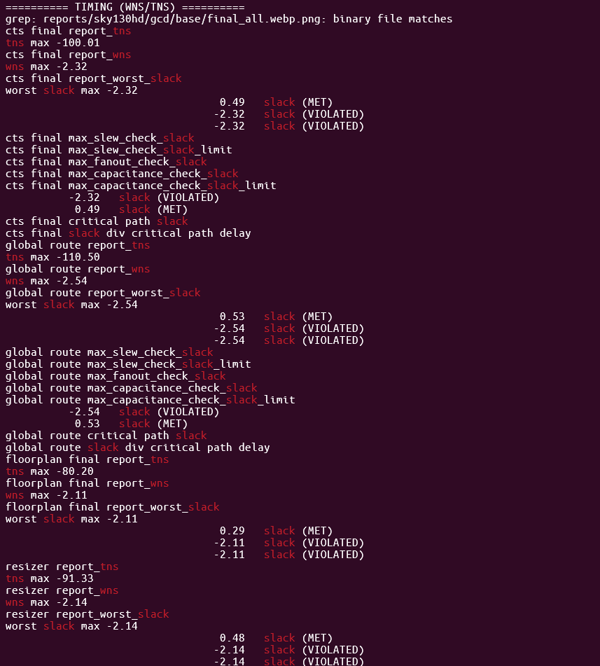

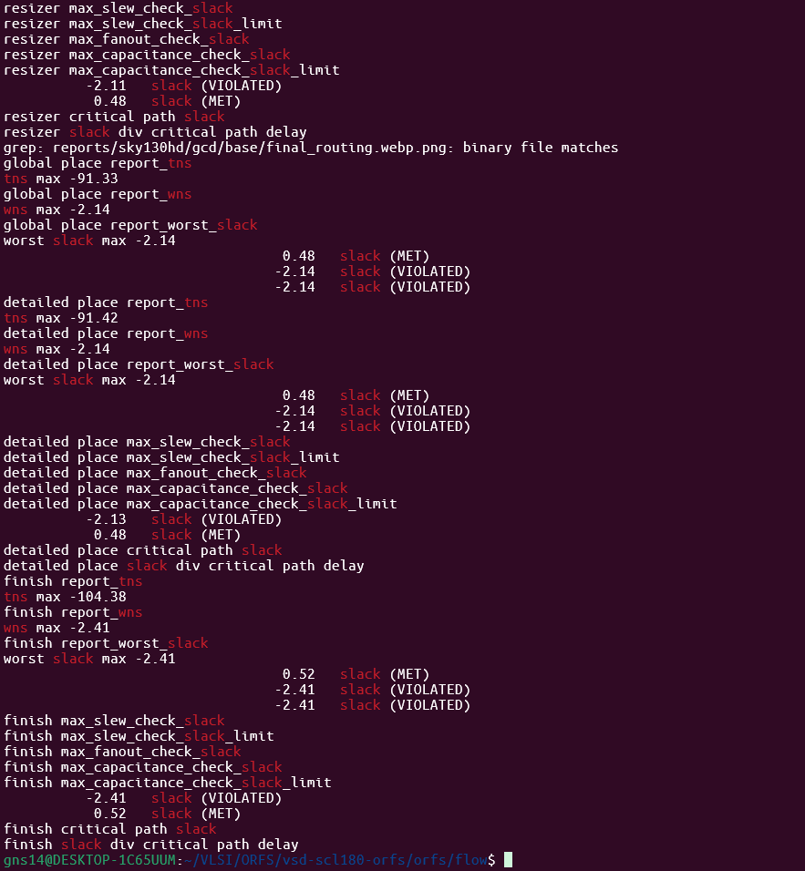

---

# The need for devcontainer:-

They define the environmental variables, base OS, and the dependencies required. Everyone's systems are fundamentally different as they would have installed the tools and programs they need, but ORFS needs to run on these machines just the same. So by using a devcontainer, we are essentially creating an isolated environment, with all the tools needed instead of relying on the system to already have it or relying on the user to manually download all of these tools and programs. These automate the creation of this isolated environment, much like OpenLane.

We use a separate file for the environment creation that handles the tcl, python, library and compiler installation(Dockerfile) and a separate file for the tool installation itself(install-openroad.sh) because the tool, such as openroad or yosys, will depend on these environmental programs to install properly.

---

# Tool explanations

| Tool | Explanation |
|---|---|
| OpenROAD | Openroad helps with every part of the flow that involves converting a synthesized netlist into a physical design. That includes floorplan, placement, IO, CTS, timing optimization, report generation and tapcell insertion. It is the core of the RTL2GDS opensource flow. It orchestrates multiple engines rather than being a single standalone tool |
|  |  |
| Yosys | Yosys does two things, logical synthesis and technology mapping. Logical synthesis optimizes the design logically by simplifying equations and removing redundant logic. Technology mapping gives the design 'life' by giving it characteristics like timing, area, power and other physics. |
|  |  |
| TritonCTS | Clock is the most vital signal in the design. We need to ensure that the clock signals reach their target at the exact same time ideally. We cannot simply spam clock wires because wires have resistance and capacitance, and each wire has different length and would suffer different levels of these parasitic conditions. Hence, Triton CTS tries to account for all of this and build a clock network that minimizes skew. |
|  |  |
| FastRoute | Provides the detailed routing tool such as TritonRoute with the rough skeleton such as corridors and alignments for the wires it deals with. The solution size for routing is incredibly huge, hence flat iteration is not feasible, hence this two-step process. |
|  |  |
| OpenSTA | OpenSTA is a static timing analysis tool. It is necessary to ensure positive slack and hold for all the parts of the circuit. This is essentially making sure that your data signals arrive on time with respect to the clock. Without this, data could be late, lost, garbled due to metastability. Thus, we run OpenSTA after each significant step to make sure that our design's logic is operational with added realism. It's 'static' because it does not need to look for actual data to propagate through the circuit to find its timing because everything is instead mathematically modelled |
|  |  |
| KLayout | It is a layout viewing tool specifically built around the final .gds files, while magic is built for editing and openroad gui is built for viewing the intermediate def and odb files. |
|  |  |
| Python | Python is used to automate the flows. There are so many logs, reports, constraints and tools. It is not feasible to manually open, check and run the tools one after the other. This is where python helps to automate the flow at a higher level so iterating becomes easier. |
|  |  |
| Make | It is also used for scripting but with 'intelligence'. Bash scripts for instance will run the full flow again and again when executed. Make can detect the previous outputs and resume from the last successful checkpoint instead of running everything again. |
|  |  |
| Git | In VLSI EDA ecosystems, usually we use dozens of tools at the same time and it becomes virtually impossible to version manage all of them manually. Git helps do this automatically by updating all these with single commands. We used submodules in this installation which linked other gits in a chain. It would be so much more difficult to find these files and download them manually |

---

# What ORFS automates?

ORFS automates the flow by using various make files and connects to EDA tools to create the full RTL2GDS flow.

---

# How Makefiles orchestrate the flow?

The makefiles are used to automate the steps themselves individually on a lower level. ORFS sits on top of these makefiles, running them one after another.

---

# Where synthesis ends and physical design begins?

Synthesis ends after the logical synthesis or logic optimization and the technology mapping end. Usually a timing closure is also expected after this before physical design starts, with floorplan.

---

# Where timing is checked?

Timing is checked after almost every significant step. After logical synthesis, after placement, CTS, PDN and routing. This is because checking once at the end is too vague and it is very hard to retrace the point in the flow at which the error originated without this.

---

# Where GDS is produced?

GDS is generated at the very end of the flow after routing. In the ORFS flow specifically, the final flow point is converted into a GDS.

---

# Phase 4:-

I noticed that the keyword elapsed time was used in the timing report of every stage so I did a grep search in the folder for that keyword to find the runtime.

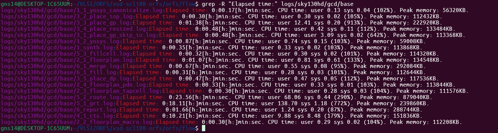

Adding up gives roughly 65 seconds of runtime.

---

# Phase 5:-

## This is me using export to add yosys to the path and verifying using echo

I had to do this manually because there was an older version of yosys installed in the system and it was taking precedence over the yosys that the binary files had automatically installed, which was of a later version.

---

## This is when I had to sort and search through the files to see if the eqy installation was successful

Even though EQY was installed, the tool was not able to find it. Admittedly, LLMs such as Chatgpt were used to aid me with these commands, but I do understand the motive now.

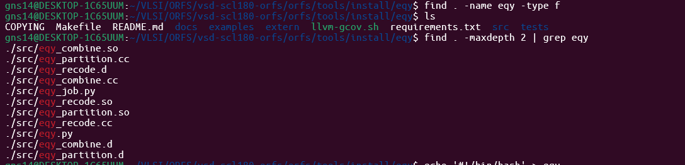

---

## I verify that the eqy.py file actually works and then export the path for the tool to find it

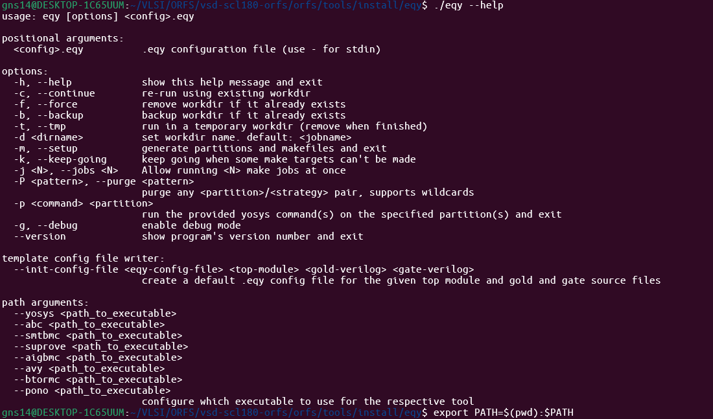