# WEEK 4

# Understanding the Wrapper Module

Let's start with the very top. The module is defined here at the very start. This is the module that would be called in the Caravel ecosystem when building. We can also see that it has a parameter for the number of bits used.

There is an immediate use of `ifdef` next.

`ifdef` is used in order to define elements of a circuit as and when required. Now that these power pins are defined through `ifdef`, they would only get defined if there is a `define USE_POWER_PINS` in the module. This allows us to "pick and place" the definitions by leveraging the preprocessor.

Another thing to note is defining the power pins themselves. Ideologically, since RTL lives at the highest level of abstraction and PDN happens way below in the RTL-to-GDS process, it might seem odd to define power pins in an RTL. The reason for doing this is because this is not a standalone module. This is part of the larger Caravel ecosystem, and that means that these power pins need to be exposed at this level of abstraction to properly define the properties.

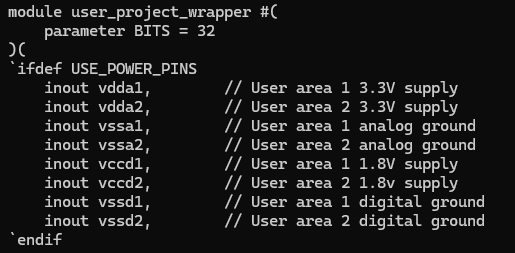

---

The logic analyser has an output enable for each output line. It is low active.

### Why use an output enable for each output wire instead of one global enable?

This is for granularity of control. Enabling or disabling 128 signals will get tiring to manage fast, as you would have to deal with 128 output signals any time you want to check even a tiny change.

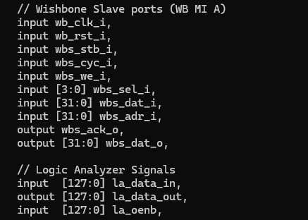

---

Another interesting thing to note is how the IO pads have a variable that is not defined before in this Verilog module.

### What is it then?

This is called a preprocessor macro. This allows us to set values for instantiations beyond the scope of the current Verilog module. Somewhere in the full ecosystem, there would be a definition for this macro, and that is how we are able to use it here without defining it.

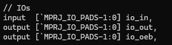

A quick grep search does validate this.

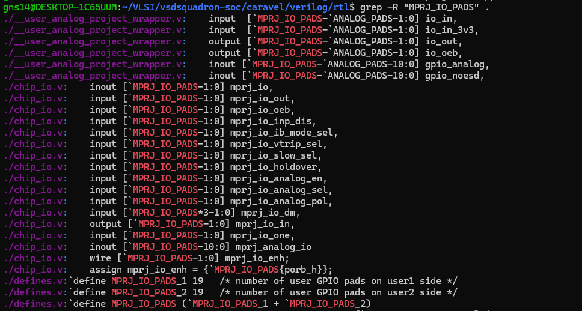

---

We can see definitions of an analog IO even though RTL is entirely digital.

This is because, if we want to fetch the exact analog voltages of our pins, then we can define the pins as analog so that we may add ADCs and DACs on them. It provides us the circuitry required to interpret analog signals.

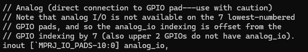

---

Here we can see the usage of `ifndef`.

`ifndef` is the exact opposite of `ifdef`. This might sound redundant, but it is specifically useful when we want exclusions.

In this particular case, we are using the definition to route the debug output to the debug region and everything else to the user region. If `GPIO_TESTING` is defined, then this circuitry would not exist, and we can instead define custom logic in its place.

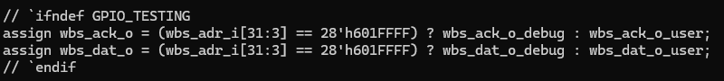

---

Both `ifndef` and `ifdef` tell us the importance of knowing the other modules you are interfacing with, especially in large integrations like these, to both have better compliance across modules and make the code easier to write.

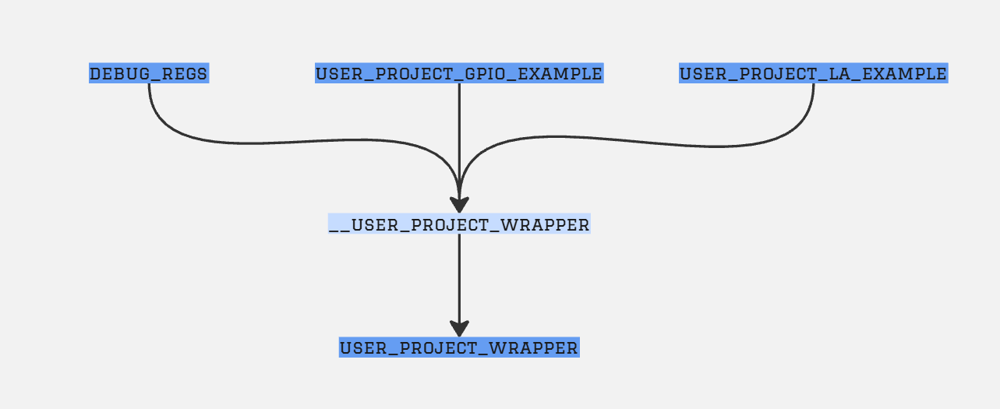

All of the modules used in this module are defined inside `ifdef` and `ifndef` blocks, the nature of which has been discussed above.

Thus, these module instantiations might not happen if the definitions align when this module (`user_project_wrapper`) itself is called.

---

# Exporting user_project_wrapper to ORFS and Running the Flow

The flow claimed that there was simply not enough space available for placing the required IO pins.

Hence, I manually added a die area to the configuration.

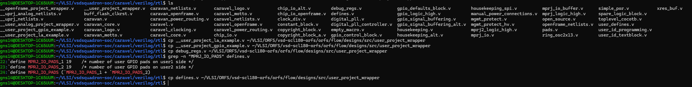

---

## Manual Die Area Addition

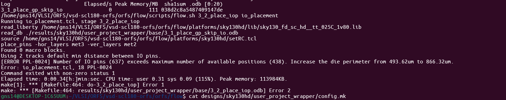

### Original Configuration

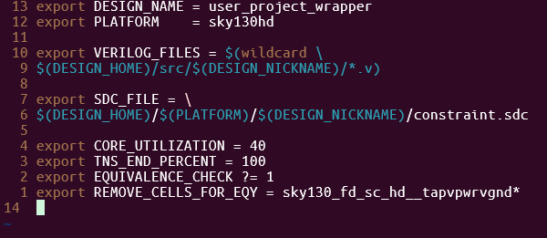

### Modified Configuration

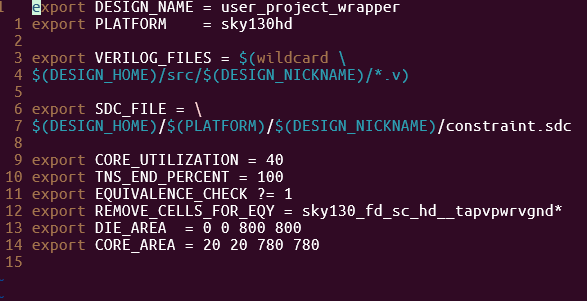

---

However, this introduced another error.

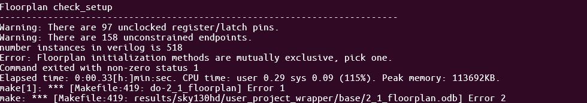

This is essentially happening because I have mentioned both core utilization and the area itself, which are mutually exclusive in this flow.

If I define the core utilization, the flow would calculate the area automatically. Alternatively, I can define the area manually and allow the flow to use that value. However, I cannot specify both simultaneously.

To resolve this, I commented out the core utilization assignment.

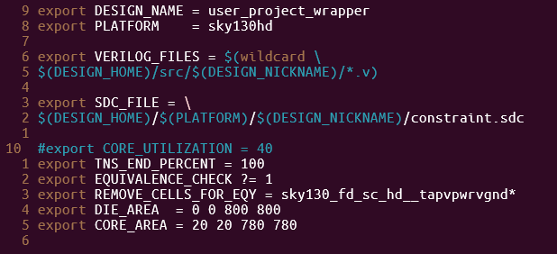

---

# Clock Tree Synthesis Error

Next, I ended up with this error during CTS.

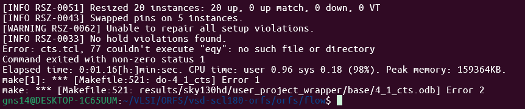

This happened because the clock names were not modified from the copy-pasted `.sdc` file.

After modifying the clock names:

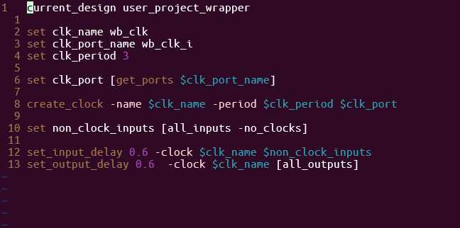

the flow was able to proceed further.

---

# Routing Repair Error

We then move on to the next error in routing repair.

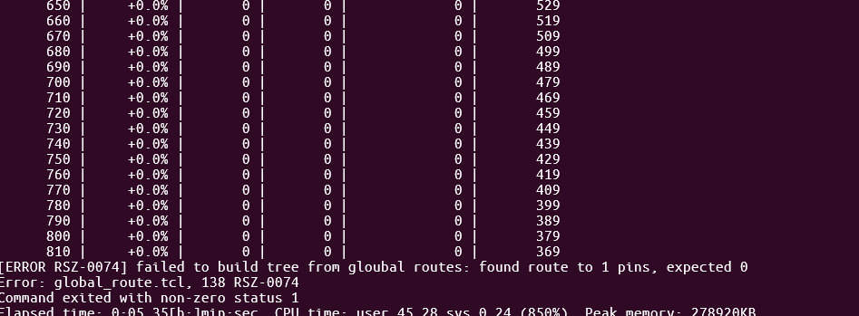

However, global routing shows that the nets are properly routed and the resizer is trying to fix roughly a thousand violations, but oddly enough, it is not changing anything during the iterations themselves.

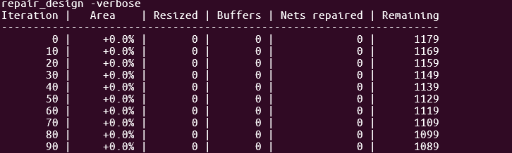

Due to the unusual behaviour observed only during the repair stage, while the remaining stages of the flow completed without reporting major issues, the error is more likely associated with the repair process itself rather than the design implementation.

Hence, we elect to skip over this phase and continue with the remainder of the flow.

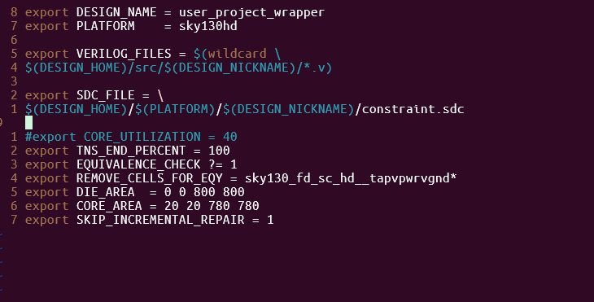

---

# Final Output After Debugging

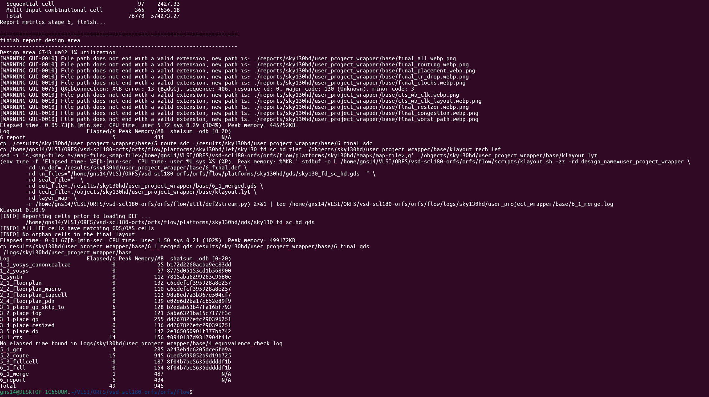

---

# Phase 5: Collection of RTL-to-GDS Implementation Outputs

| Output Category | Generated File | Description |
|----------------|----------------|-------------|
| Synthesized Design Database | `1_synth.odb` | OpenDB database generated after synthesis and technology mapping. |
| Floorplan Database | `2_floorplan.odb` | Database containing floorplan information including die/core dimensions and initial placement constraints. |
| Placement Database | `3_place.odb` | Database after standard-cell placement optimization. |
| Clock Tree Synthesis Database | `4_cts.odb` | Database after clock tree insertion and clock network optimization. |
| Global Routing Database | `5_1_grt.odb` | Database after global routing stage. |
| Detailed Routing Database | `5_2_route.odb` | Database after detailed routing completion. |
| Fill Cell Database | `6_1_fill.odb` | Database after fill-cell insertion and physical finishing operations. |
| Final DEF | `6_final.def` | Final Design Exchange Format file containing complete physical implementation information. |
| Final Verilog Netlist | `6_final.v` | Post-implementation gate-level netlist generated by ORFS. |
| Final SDC | `6_final.sdc` | Final timing constraints file used for implementation and signoff. |
| Final SPEF | `6_final.spef` | Standard Parasitic Exchange Format file containing extracted RC parasitics. |
| Global Routing Guide | `route.guide` | Routing guide generated during the global routing stage. |
| Final GDSII Layout | `6_final.gds` | Final manufacturable GDSII layout generated after DEF-to-GDS conversion and library merge. |
| Merged GDSII Layout | `6_1_merged.gds` | Intermediate merged GDS generated during the final layout assembly stage. |
| Timing Constraint Reference | `updated_clks.sdc` | Updated clock constraint file generated during timing optimization. |
| Memory Statistics | `mem.json` | Resource utilization and memory statistics generated during implementation. |

---

## Implementation Summary

The RTL-to-GDS flow for `user_project_wrapper` was successfully completed using OpenROAD Flow Scripts (ORFS).

The flow progressed through:

- Synthesis
- Floorplanning
- Placement
- Clock Tree Synthesis (CTS)
- Global Routing
- Detailed Routing
- Fill-Cell Insertion
- Parasitic Extraction
- Final GDSII Generation

The final implementation artifacts include:

- Gate-level netlist (`6_final.v`)
- Extracted parasitics (`6_final.spef`)
- Final DEF (`6_final.def`)
- Manufacturable GDSII layout (`6_final.gds`)

---

# Final GDS Output

After getting the original GDS output, it looked suspiciously uniform, with almost identical standard cells spanning across the design.

I determined that the area was too large and the utilization had fallen to approximately 1%.

Hence, I dramatically reduced the core and die area in order to improve the design's area efficiency.

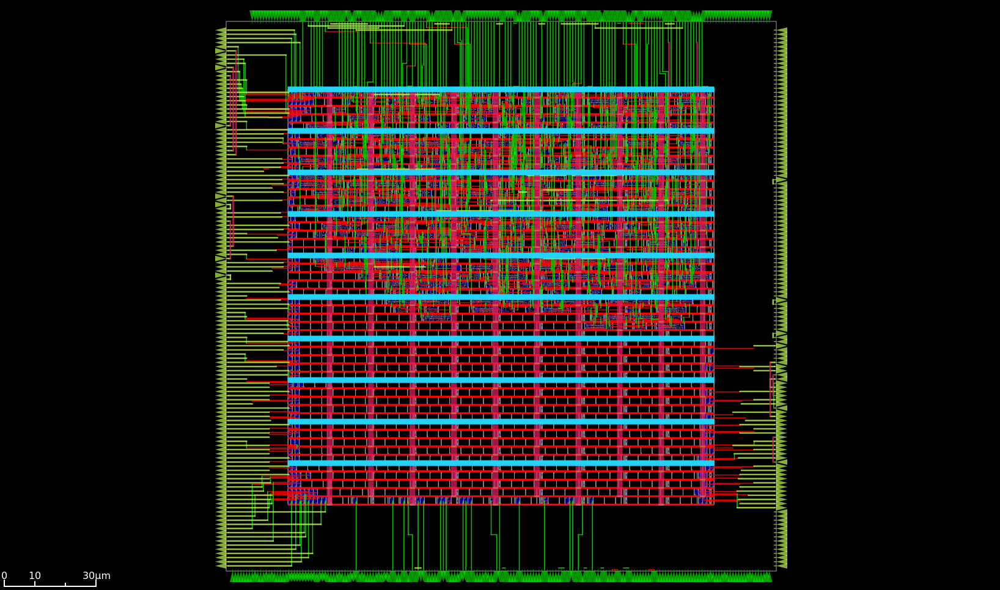

The layout did open correctly in KLayout, but the routing and cells were more visible in OpenROAD GUI, hence `openroad -gui` was used for the final screenshot.

---

# Final Design Parameters

| Parameter | Value |
|------------|--------|
| Design Area | 6320 µm² |
| Final Die Area | 180 µm × 180 µm |
| Utilization | 33% |
| Instances | 518 |
| Vias | 3278 |
| Maximum Metal Layer | Metal 3 |
| Total Wirelength | 26344 µm |
| Timing Violations | No slack violations |